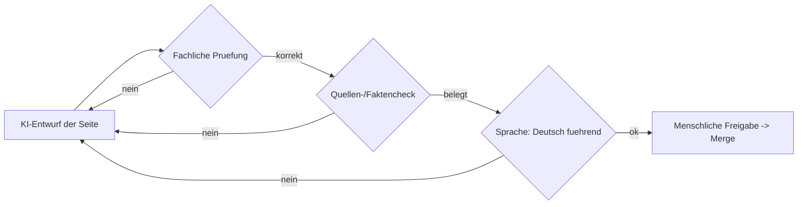

# MIGRATION.md — Überführung eines MII-KDS-Moduls in diesen HL7 FHIR IG

Überführung eines bestehenden, bisher auf **Simplifier** publizierten MII-KDS-Moduls
in das **IG-Publisher-basierte** Zielformat. Zwei Wege: **(A) manuell** und
**(B) KI-gestützt** — beide mit verpflichtender abschließender menschlicher Begutachtung.

Sprache: **Deutsch ist Standard/verbindlich**, Englisch optional.

## Schnellstart & Wegwahl

**Was wird migriert?** Ein bestehendes MII-KDS-Modul — bestehend aus einem
**gerenderten Simplifier-IG** und einem **Quell-Repo mit FSH** (Profile,
Extensions, ValueSets, CodeSystems, Logical Model, CapabilityStatement, Beispiele)
sowie den **Manteldokument-Narrativen** — wird in das **IG-Publisher-Format dieses
Repos** überführt. **Ergebnis:** ein lokal/CI baubarer HL7-FHIR-IG (statisches
HTML, `output/index.html`) mit denselben Artefakten + deutschen Narrativen.

**Dieses Repo IST die Zielvorlage.** Du arbeitest entweder (1) in einem **frischen
Klon** dieses Repos als neuem Modul-IG, oder (2) bringst die Vorlage in einen
**isolierten Branch `hl7-ig-build`** eines **bestehenden Modul-Repos** ein (→ §11).

**Welcher Weg?**
- **KI-gestützt** (empfohlen für strukturgleiche Module mit großem Artefaktbestand)
  → **Teil B (§4)** — dort kopierfertiger Prompt + Befehlsfolge.
- **Manuell** (kleine Module, viele neue fachliche Entscheidungen) → **Teil A (§3)**.

Beide Wege haben **identische** Akzeptanzkriterien (§10) und verpflichtende
Review-Gates (§8); Deutsch bleibt führend; keine eigenständige Veröffentlichung.

## 1. Voraussetzungen
- Java 17+, Node 20+
- Ruby + Jekyll (HTML-Build des IG Publishers; [Installation](https://jekyllrb.com/docs/installation/)) —
  bei Ruby-Versionsmanagern (chruby/rbenv/rvm) `GEM_HOME`/`PATH` der Build-Shell beachten
- `npm install -g fsh-sushi`
- `npm install -g gofsh` **nur**, falls Quellen ausschließlich als FHIR-JSON/XML vorliegen (siehe §2)
- Git; Arbeits-Branch (kein direkter Push auf `main`)
- IG Publisher: `./_updatePublisher.sh` bzw. `_updatePublisher.bat`

## Setup: Repos, Verzeichnisse & Git-Schritte

Beteiligt sind **zwei** Repos:
- **Quell-Modul-Repo** — das bestehende MII-Modul (FSH + Simplifier-Narrative),
  z. B. `kerndatensatz-dokument` (= `SOURCE_REPO_URL`).
- **Ziel = dieses Template-Repo** — liefert das IG-Publisher-Format
  (= `TARGET_TEMPLATE_REPO`).

### Standardfall: im bestehenden Modul-Repo, isolierter Branch (§11)
Ergebnis **und** Build entstehen **im Modul-Repo** auf dem Branch `hl7-ig-build`,
der **nie** in den Default-Branch (`dev`/`master`/`main`) gemergt wird:

```bash
# 1. Modul-Repo klonen (oder vorhandenen Klon nutzen), Arbeitsbranch anlegen
git clone <SOURCE_REPO_URL> modul && cd modul
git checkout -b hl7-ig-build origin/master      # bzw. origin/<default-branch>

# 2. Template-Dateien aus diesem Repo in den Branch bringen — gemäß Übernehmen-/
#    Nicht-übernehmen-Liste (skills/mii-ig-migration/references/migration-agent-spec.md §5a.2):
#    übernehmen: ig.ini, sushi-config.yaml (Metadaten anpassen), input/pagecontent/,
#    input/translations/, tools/, .github/workflows/ig-validate.yml + ig-publish-pages.yml
#    NICHT übernehmen/überschreiben: Modul-README, Modul-CI (main.yml), qc/,
#    kuratierte input/ignoreWarnings.txt; Vorlagen-Beispiele (input/fsh der Vorlage) löschen.
#    Reale Modul-FSH (input/fsh/…) bleiben unverändert.

# 3. Pages-Workflow auf den Branch beschränken
#    ig-publish-pages.yml ->  on: push: branches: [ "hl7-ig-build" ]

# 4. Bauen
./_updatePublisher.sh && ./_genonce.sh

# 5. Commit + Push + PR — IMMER Ziel hl7-ig-build, NIE dev/master/main
git add -A && git commit -m "IG-Publisher-Build (hl7-ig-build)"
git push -u origin hl7-ig-build
#   Pull Request öffnen mit base = hl7-ig-build
```

### Alternative: frischer Klon des Template-Repos (neues Modul, kein Quell-Repo)
```bash
git clone <TARGET_TEMPLATE_REPO> mein-modul && cd mein-modul
# sushi-config.yaml/ig.ini auf Modul-Metadaten setzen; eigene FSH nach input/fsh/;
# Vorlagen-Beispiele in input/fsh/ ersetzen; dann ./_updatePublisher.sh && ./_genonce.sh
```

### Wo wird was geschrieben (Ausgabeorte)
| Pfad | Inhalt | Versioniert? |
|------|--------|--------------|
| `input/` | Eingaben: FSH, `pagecontent/`, `translations/`, `images/` | ja |
| `fsh-generated/` | von `sushi .` erzeugte FHIR-JSON — nicht manuell editieren | nein (`.gitignore`) |
| `output/` | fertiger IG: `index.html`, `qa.html`/`qa.txt`, Packages | nein (`.gitignore`) |
| `.ai-log/` | Migrationsbericht/Inventar (KI-Pfad) | nein (`.gitignore`) |
| `input-cache/` | `publisher.jar` (vom Updater geladen) | nein (`.gitignore`) |

> Hinweis: Diese `.gitignore`-Zuordnung gilt für dieses Template. In einem
> bestehenden Modul-Repo greift dessen eigene `.gitignore` (einige MII-Module
> versionieren z. B. `fsh-generated/`).

## 2. GoFSH — nur bedingt nötig
FSH ist das Quellformat dieses IG. Ob GoFSH (FHIR→FSH) als Migrationsschritt nötig
ist, hängt von der Quelle ab:
- **Quelle enthält bereits FSH** (z. B. `kerndatensatz-meta`): GoFSH **entfällt** — FSH direkt übernehmen.
- **Quelle enthält nur generierte JSON/XML-Ressourcen** (Simplifier-/Forge-Export ohne FSH): GoFSH einmalig zur Erzeugung editierbarer FSH nutzen.

## 3. Teil A — Manuelle Migration
- [ ] **A0 Vorbereitung:** Modulname, Canonical-Basis, CalVer-Version festlegen; EU-Schichtung (optionale Dependencies in `sushi-config.yaml`) wählen. Bei Anwendung auf ein bestehendes Modul-Repo: isolierten Branch `hl7-ig-build` anlegen (siehe §11) — `dev`/`master`/`main` bleiben unberührt.
- [ ] **A1 Skelett:** dieses Repo klonen; `ig.ini` und `sushi-config.yaml` anpassen (id, canonical, version, title, dependencies, Menü).
- [ ] **A1b Vorlagen-Beispiele löschen:** `input/fsh/examples.fsh` und alle Beispiel-Instanzen der Vorlage **händisch entfernen** (nicht übernehmen), um Konflikte mit den realen Modul-Beispielen zu vermeiden.
- [ ] **A2 Artefakte:** FSH aus dem Quell-Repo nach `input/fsh/` übernehmen; falls nur JSON/XML: `gofsh ./quelle -o input/fsh`. IDs/URLs unverändert lassen; MII-Namenskonvention beibehalten (maßgeblich: [`qc/custom.rules.yaml`](qc/custom.rules.yaml) + [Meta-Wiki](https://github.com/medizininformatik-initiative/kerndatensatz-meta/wiki)).
- [ ] **A3 Narrative:** Manteldokument-Inhalte gemäß Crosswalk (§6) nach `input/pagecontent/*.md` (deutsch) überführen; `context.md`, `references.md`, `use-cases.md` befüllen; Model-to-Profile-Mapping in `data-sets.md` pflegen. **Simplifier-/FQL-Direktiven** (`{{render}}`, `{{pagelink}}`, `{{tree}}`, `<fql>` …) gemäß [`skills/mii-ig-migration/references/fql-crosswalk.md`](skills/mii-ig-migration/references/fql-crosswalk.md) ersetzen; Fundstellen finden mit [`tools/fql-scan.sh`](tools/fql-scan.sh). Regeln sind in [`fql-rules.tsv`](skills/mii-ig-migration/references/fql-rules.tsv) **per Hand erweiterbar**.
- [ ] **A4 Mehrsprachigkeit (optional):** Standard ist Deutsch. Für optionales
  Englisch (verifizierte Mechanik, IG Publisher 2.2.x):
  - **Ressourcen-Texte (rendern heute):** je StructureDefinition/CodeSystem/
    Questionnaire ein Translation-Supplement `input/translations/en/<Typ>-<id>.po`
    (`msgid` = exakter dt. Quelltext aus `fsh-generated/resources/<Typ>-<id>.json`,
    `msgstr` = englisch). **Nicht** unterstützt: ValueSet, ImplementationGuide,
    Menü — entsprechende `.po` werden vom Publisher ignoriert.
  - **Narrative-Seiten (zukunftssicher):** je `input/pagecontent/<name>.md` eine
    Übersetzung `input/pagecontent/<name>-en.md`. Wird aktuell noch nicht gerendert
    (HL7 „ToDo"), aber korrekt vorbereitet; `/en/`-Seiten zeigen bis dahin Deutsch
    mit Standardhinweis (erwartet).
  - **Vorhandene EN-Fassung übernehmen (Harvest):** Hat die Quelle bereits Englisch
    (z. B. MII KDS Person), die EN-Texte übernehmen statt neu zu übersetzen —
    Ressourcen aus FSH-`translation`-Extensions/Designations, Narrative aus dem
    parallelen EN-Guide.
  - Konfig/Datei-Konventionen: [`skills/ig-translate/references/translate-spec.md`](skills/ig-translate/references/translate-spec.md);
    Zielpfade prüfen mit [`tools/ig-translate.sh`](tools/ig-translate.sh) `--scan en` / `--validate en`.
- [ ] **A5 Build & QA:** `./_genonce.sh` (bzw. `.bat`); `output/qa.html`/`qa.txt` → „Errors: 0"; `output/index.html` sichten.
- [ ] **A6 Benutzerdefinierte Seiten:** §7 anwenden (Review-Gate).
- [ ] **A6b Vorlage-Bereinigung (nach validierter Migration):** Reine Vorlage-/
  Migrations-Dateien entfernen, sofern die Vorlage als Ganzes übernommen wurde.
  **Erst nach** grünem Build/QA (A5) und bestätigten Narrativen (A6). Liste:
  - **Immer entfernen:** `MIGRATION.md`, `DESIGN.md`, `ROLES.md`, `SOURCES.md`,
    `AI_USAGE.md`, `skills/`, `tools/verify-template.sh`, `.ai-log/`,
    `input/images/mii-logo-PLATZHALTER.svg`.
  - **Abwägen (behalten oder entfernen):** Governance-/Community-Doku
    (`CONTRIBUTING.md`, `COMMENT_RESOLUTION.md`, `PUBLISHING.md`,
    `NOTIFICATIONS.md`, `TERMINOLOGY.md`, `CODE_OF_CONDUCT.md`, `SECURITY.md`,
    `NOTICE`, `CHANGELOG.md`), `AGENTS.md`/`CLAUDE.md` + Skill-Symlinks
    (`.claude/`, `.agents/`), `.devcontainer/`, `.vscode/`, `advisor.json`,
    `tools/check-updates.py`.
  - **Niemals entfernen:** `input/fsh`, `input/pagecontent`, `input/translations`,
    `input/ignoreWarnings.txt`, `input/includes`, `sushi-config.yaml`, `ig.ini`,
    `package.json`, `publication-request.json`, `qc/`, `.gitignore`, `LICENSE`.
  - Anschließend verbleibende Verweise auf entfernte Dateien (README/AGENTS/
    Workflows) bereinigen und Build erneut grün stellen.
- [ ] **A7 PR & Review:** Branch pushen, Pull Request öffnen; Review-Gates (§8) durchlaufen.

## 4. Teil B — KI-gestützte Migration
Nutzt die herstelleragnostische Spezifikation in [`skills/mii-ig-migration/`](skills/mii-ig-migration/).
Voraussetzung: Tools aus §1 installiert; Template-Repo lokal geöffnet (dieses Repo
ist das Ziel) bzw. Branch `hl7-ig-build` angelegt (§11).

- [ ] **B0 Eingaben festlegen** — nur **drei** echte Eingaben; alle übrigen
  Metadaten (`id`, `canonical`, `packageId`, `dependencies`, `publisher`, Modulname)
  **liest der Agent aus der Quelle** (`<SOURCE_REPO>/sushi-config.yaml` +
  `package.json`, bzw. der `ImplementationGuide`-Ressource bei reinen JSON/XML-Quellen)
  und übernimmt sie unverändert (Bestandsschutz). Felder/Herkunft/Zielorte: [`migration-agent-spec.md`](skills/mii-ig-migration/references/migration-agent-spec.md) §2.1.

  | Eingabe | Beispiel (Modul Dokument) |
  |---|---|
  | `SOURCE_RENDERED_IG_URL` | `https://simplifier.net/guide/mii-ig-dokument-de` |
  | `SOURCE_REPO_URL` | `https://github.com/medizininformatik-initiative/kerndatensatz-dokument` |
  | **Ziel-`version`** (CalVer) | `2026.0.1` (Default = Version der Quelle) |

  `TARGET_TEMPLATE_REPO` = dieses Repo. Floating Pins der Quelle (`…: 1.5.x`) beim
  Übernehmen auf konkrete Versionen festlegen.

- [ ] **B1 Migration starten (Claude Code).** Repo vorbereitet (→ „Setup"), dann
  den Skill **explizit beim Namen** mit den B0-Eingaben aufrufen — **mehr nicht**.
  Der Skill bringt Schrittfolge, Aufgaben, Leitplanken (§4) und Review-Gates (§6)
  selbst mit (`SKILL.md` → `migration-agent-spec.md`); das gehört **nicht** in den
  Prompt (Single Source of Truth — sonst Drift zwischen Prompt und Skill):

  ```text
  Nutze den Skill mii-ig-migration.
  SOURCE_RENDERED_IG_URL=<…>   SOURCE_REPO_URL=<…>   Zielversion=<CalVer, Default = Quelle>
  ```
  (id/canonical/packageId/dependencies/publisher liest der Agent aus der Quelle — nicht angeben.)

  **Fallback — Agenten OHNE Skill-Mechanismus** (z. B. manche GPT/Codex-Setups):
  Dort lädt sich keine `SKILL.md` automatisch; das vendor-neutrale **Prompt-Gerüst
  aus [`migration-agent-spec.md`](skills/mii-ig-migration/references/migration-agent-spec.md) Anhang B** verwenden — es injiziert genau die
  Schritte/Leitplanken, die bei Claude Code der Skill liefert.

- [ ] **B2 Was der Agent ausführt** (Schritte → Befehle):
  1. **Inventarisierung** der Quelle → `.ai-log/source-inventory.json`
  2. **Skelett:** `ig.ini`/`sushi-config.yaml` mit `MODULE_METADATA`; Vorlagen-Beispiele löschen
  3. **Artefakte:** FSH übernehmen (nur JSON/XML: `gofsh ./quelle -o input/fsh`); Test: `sushi .`
  4. **Narrative** gemäß Crosswalk (§6); Simplifier-/FQL-Direktiven via `tools/fql-scan.sh` + [`fql-crosswalk.md`](skills/mii-ig-migration/references/fql-crosswalk.md)
  5. **Mehrsprachigkeit** (optional, §B5): `tools/ig-translate.sh --scan en`
  6. **Build & QA:** `./_updatePublisher.sh && ./_genonce.sh` → `output/qa.txt` „Errors: 0"
  7. **Bericht** `.ai-log/migration-report.md`
  8. **Pull Request** mit Ziel `hl7-ig-build`
- [ ] **B3 Übergabe:** Agent stoppt an den Review-Gates (§8); Freigabe/Merge nur durch Menschen.
- [ ] **B4 Vorlage-Bereinigung (optional, auf Bestätigung):** Nach validierter
  Migration den Skill [`skills/template-sanitize/`](skills/template-sanitize/) aktivieren — er entfernt auf
  ausdrückliche Nutzerbestätigung die reinen Vorlage-/Migrations-Dateien
  (Pendant zu A6b) via [`tools/template-sanitize.sh`](tools/template-sanitize.sh) (Dry-Run-Default, `--apply`).
- [ ] **B5 Übersetzung (optional, auf Bestätigung):** Für eine englische
  Sprachausgabe den Skill [`skills/ig-translate/`](skills/ig-translate/) aktivieren — Modus **translate**
  (LLM, de→en) oder **harvest** (vorhandene EN-Fassung der Quelle übernehmen, z. B.
  MII KDS Person). Erzeugt Ressourcen-Supplements (rendern) und zukunftssichere
  `*-en.md`-Seiten; Deutsch bleibt führend, jede Übersetzung mit `TODO:REVIEW`,
  Review-Gate C (§8) verpflichtend. Pendant zu A4.

## 5. Wahl des Weges
- **Manuell:** kleine Module, viele neue fachliche Entscheidungen oder fehlende Agenten-Infrastruktur.
- **KI-gestützt:** strukturgleiche Module mit großem Artefaktbestand.

Identische Akzeptanzkriterien (§10) und Review-Gates (§8) in beiden Fällen.

## 6. Crosswalk Manteldokument → IG
| Manteldokument | Ziel im IG |
|----------------|------------|
| Beschreibung Modul | `index.md` |
| Release Notes | `changes.md` |
| Kontext / Bezüge zu anderen Modulen | `context.md` |
| Referenzen | `references.md` |
| Anwendungsfälle / Szenarien | `use-cases.md` |
| Datensätze inkl. Beschreibungen (+ Model-to-Profile-Mapping) | `data-sets.md` |
| Informationsmodell / UML | `uml.md` + Logical Model |
| Conformance (Must Support, fehlende Daten, Such-API) | `conformance.md` |
| FHIR Profile / CapabilityStatement / Terminologien | `input/fsh/` → Artifacts |
| Impressum/Autoren/Copyright/Disclaimer | `index.md` (Fuß) + `sushi-config.yaml` |

## 7. Benutzerdefinierte Seiten & Review-Gate
Handgeschriebene Narrative-Seiten in `input/pagecontent/` werden **nicht** aus
FHIR-Artefakten generiert und müssen bewusst migriert werden.
- [ ] **Bestand erfassen:** alle Seiten des Quell-IG auflisten; je Seite generiert vs. handgeschrieben markieren.
- [ ] **Übernehmen:** handgeschriebene Inhalte deutsch nach `input/pagecontent/` überführen; Links/Anker auf neue Artefakt-IDs aktualisieren.
- [ ] **Kennzeichnen:** bei KI-gestützter Migration jede KI-entworfene/-migrierte Seite markieren (PR-Label `ai-authored`, Vermerk im PR).

**Review-Gate (verpflichtend):** kein Merge benutzerdefinierter Seiten ohne
menschliche Freigabe. Bei KI-Migration zusätzlich der folgende Ablauf:



Kriterien: inhaltliche Korrektheit (Fachvertretung), Quellenbelege ohne erfundene
Fakten, Deutsch als Standard. Erst nach Freigabe erfolgt der Merge.

## 8. Review-Gates & Governance-Freigabe
- [ ] **Gate A:** URL-/ID-Bestandsschutz + Artefaktvollständigkeit
- [ ] **Gate B:** Narrative inkl. Pflichtabschnitte; benutzerdefinierte Seiten freigegeben (§7)
- [ ] **Gate C:** Sprachführung (Deutsch Standard; optionales Englisch konsistent)
- [ ] **Gate D:** Governance-Freigabe (TF KDS / AG IOP / NSG) — erst danach greift der Pages-Workflow

## 9. Best-Practice-Checkliste
- [ ] HL7-Seitenraster (Home/Guidance/Conformance/Artifacts/Downloads/Versioning)
- [ ] Zielgruppen (Intended Audience) benannt
- [ ] Model-to-Profile-Mapping-Tabelle gepflegt
- [ ] Must Support, Konformitätsverben, fehlende Daten, Such-API beschrieben
- [ ] CapabilityStatement vorhanden
- [ ] Beispiele validieren; `qa.txt` „Errors: 0"
- [ ] Stabile Canonical URLs / Versionierung (CalVer); Bestandsschutz gewahrt
- [ ] Sicherheit & Datenschutz adressiert

## 10. Definition of Done
- [ ] `sushi .` und IG-Publisher-Build fehlerfrei (`Errors: 0`)
- [ ] Crosswalk vollständig; Canonical-URL-Diff leer (Bestandsschutz)
- [ ] `i18n-default-lang: de` gesetzt
- [ ] Vorlagen-Beispiele entfernt (`input/fsh/examples.fsh`)
- [ ] (bei bestehendem Modul-Repo) Arbeit nur im Branch `hl7-ig-build`; Default-Branch unverändert
- [ ] Benutzerdefinierte Seiten via Review-Gate (§7) freigegeben
- [ ] PR mit Migrationsbericht; alle Review-Gates (§8) abgezeichnet

## 11. Anwendung auf ein bestehendes Modul-Repo (isolierter Branch & Pages)
Additiv und rückbaubar, **ohne** `dev`/`master`/`main` zu verändern:
- [ ] Branch `hl7-ig-build` vom Default-Branch anlegen (wird nie dorthin gemergt).
- [ ] Template-Dateien gemäß der präzisen Übernehmen-/Nicht-übernehmen-Liste
  ([`skills/mii-ig-migration/references/migration-agent-spec.md`](skills/mii-ig-migration/references/migration-agent-spec.md) §5a.2) + **reale**
  Modul-FSH in den Branch übernehmen; Vorlagen-Beispiele löschen. Modul-`README`,
  Modul-CI, kuratierte `ignoreWarnings.txt`/`qc/` **nicht** überschreiben.
- [ ] GitHub Pages auf **Source = GitHub Actions** stellen; Pages-Workflow auf den Branch `hl7-ig-build` beschränken (Branch-Filter).
- [ ] Gerenderten IG (Pages-URL) im Modul-README/Wiki verlinken.
- [ ] Feature-Branches per PR **in `hl7-ig-build`** mergen (nie in den Default-Branch).
