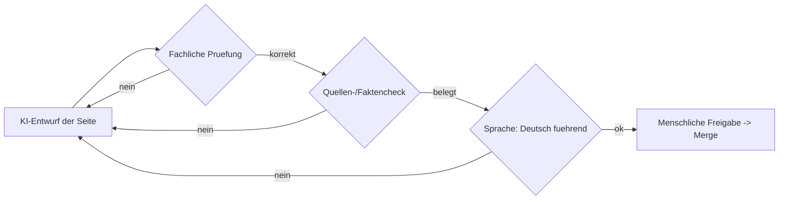

# MIGRATION.md — Überführung eines MII-KDS-Moduls in diesen HL7 FHIR IG

Überführung eines bestehenden, bisher auf **Simplifier** publizierten MII-KDS-Moduls
in das **IG-Publisher-basierte** Zielformat. Zwei Wege: **(A) manuell** und
**(B) KI-gestützt** — beide mit verpflichtender abschließender menschlicher Begutachtung.

Sprache: **Deutsch ist Standard/verbindlich**, Englisch optional.

## 1. Voraussetzungen
- Java 17+, Node 20+
- `npm install -g fsh-sushi`
- `npm install -g gofsh` **nur**, falls Quellen ausschließlich als FHIR-JSON/XML vorliegen (siehe §2)
- Git; Arbeits-Branch (kein direkter Push auf `main`)
- IG Publisher: `./_updatePublisher.sh` bzw. `_updatePublisher.bat`

## 2. GoFSH — nur bedingt nötig
FSH ist das Quellformat dieses IG. Ob GoFSH (FHIR→FSH) als Migrationsschritt nötig
ist, hängt von der Quelle ab:
- **Quelle enthält bereits FSH** (z. B. `kerndatensatz-meta`): GoFSH **entfällt** — FSH direkt übernehmen.
- **Quelle enthält nur generierte JSON/XML-Ressourcen** (Simplifier-/Forge-Export ohne FSH): GoFSH einmalig zur Erzeugung editierbarer FSH nutzen.

## 3. Teil A — Manuelle Migration
- [ ] **A0 Vorbereitung:** Modulname, Canonical-Basis, CalVer-Version festlegen; EU-Schichtung (optionale Dependencies in `sushi-config.yaml`) wählen. Bei Anwendung auf ein bestehendes Modul-Repo: isolierten Branch `hl7-ig-build` anlegen (siehe §11) — `dev`/`master`/`main` bleiben unberührt.
- [ ] **A1 Skelett:** dieses Repo klonen; `ig.ini` und `sushi-config.yaml` anpassen (id, canonical, version, title, dependencies, Menü).
- [ ] **A1b Vorlagen-Beispiele löschen:** `input/fsh/examples.fsh` und alle Beispiel-Instanzen der Vorlage **händisch entfernen** (nicht übernehmen), um Konflikte mit den realen Modul-Beispielen zu vermeiden.
- [ ] **A2 Artefakte:** FSH aus dem Quell-Repo nach `input/fsh/` übernehmen; falls nur JSON/XML: `gofsh ./quelle -o input/fsh`. IDs/URLs unverändert lassen; MII-Namenskonvention beibehalten (maßgeblich: `qc/custom.rules.yaml` + Meta-Wiki).
- [ ] **A3 Narrative:** Manteldokument-Inhalte gemäß Crosswalk (§6) nach `input/pagecontent/*.md` (deutsch) überführen; `context.md`, `references.md`, `use-cases.md` befüllen; Model-to-Profile-Mapping in `data-sets.md` pflegen.
- [ ] **A4 Mehrsprachigkeit (optional):** Standard ist Deutsch. Für optionales Englisch `.po` unter `input/translations/en` pflegen (msgid = deutsch, msgstr = englisch), inkl. `menu.po`.
- [ ] **A5 Build & QA:** `./_genonce.sh` (bzw. `.bat`); `output/qa.html`/`qa.txt` → „Errors: 0"; `output/index.html` sichten.
- [ ] **A6 Benutzerdefinierte Seiten:** §7 anwenden (Review-Gate).
- [ ] **A7 PR & Review:** Branch pushen, Pull Request öffnen; Review-Gates (§8) durchlaufen.

## 4. Teil B — KI-gestützte Migration
Nutzt die herstelleragnostische Spezifikation in `skills/mii-ig-migration/`.
- [ ] **B0 Eingaben:** `SOURCE_RENDERED_IG_URL`, `SOURCE_REPO_URL`, `TARGET_TEMPLATE_REPO`, `MODULE_METADATA`
  (Modul-`id`/Canonical/CalVer-`version`/Dependencies/Publisher — Felder & Zielorte:
  `skills/mii-ig-migration/references/migration-agent-spec.md` §2.1).
- [ ] **B1 Agent instanziieren:** Spezifikation laden; Fähigkeiten gemäß Manifest aktivieren (Web-Abruf, Repo-Read, Datei-IO, Shell, PR).
- [ ] **B2 Automatisierte Schritte:** Inventarisierung → Skelett → Artefakte (ggf. `gofsh`) → Narrative → optionale Mehrsprachigkeit → Build/QA → `migration-report` → PR. Leitplanken: URL-/ID-Bestandsschutz, Deutsch als Standard, keine Fakten-Erfindung, keine eigenständige Veröffentlichung.
- [ ] **B3 Übergabe:** Agent stoppt an den Review-Gates (§8); Freigabe/Merge nur durch Menschen.

## 5. Wahl des Weges
- **Manuell:** kleine Module, viele neue fachliche Entscheidungen oder fehlende Agenten-Infrastruktur.
- **KI-gestützt:** strukturgleiche Module mit großem Artefaktbestand.

Identische Akzeptanzkriterien (§10) und Review-Gates (§8) in beiden Fällen.

## 6. Crosswalk Manteldokument → IG
| Manteldokument | Ziel im IG |
|----------------|------------|
| Beschreibung Modul | `index.md` |
| Release Notes | `changes.md` |
| Kontext / Bezüge zu anderen Modulen | `context.md` |
| Referenzen | `references.md` |
| Anwendungsfälle / Szenarien | `use-cases.md` |
| Datensätze inkl. Beschreibungen (+ Model-to-Profile-Mapping) | `data-sets.md` |
| Informationsmodell / UML | `uml.md` + Logical Model |
| Conformance (Must Support, fehlende Daten, Such-API) | `conformance.md` |
| FHIR Profile / CapabilityStatement / Terminologien | `input/fsh/` → Artifacts |
| Impressum/Autoren/Copyright/Disclaimer | `index.md` (Fuß) + `sushi-config.yaml` |

## 7. Benutzerdefinierte Seiten & Review-Gate
Handgeschriebene Narrative-Seiten in `input/pagecontent/` werden **nicht** aus
FHIR-Artefakten generiert und müssen bewusst migriert werden.
- [ ] **Bestand erfassen:** alle Seiten des Quell-IG auflisten; je Seite generiert vs. handgeschrieben markieren.
- [ ] **Übernehmen:** handgeschriebene Inhalte deutsch nach `input/pagecontent/` überführen; Links/Anker auf neue Artefakt-IDs aktualisieren.
- [ ] **Kennzeichnen:** bei KI-gestützter Migration jede KI-entworfene/-migrierte Seite markieren (PR-Label `ai-authored`, Vermerk im PR).

**Review-Gate (verpflichtend):** kein Merge benutzerdefinierter Seiten ohne
menschliche Freigabe. Bei KI-Migration zusätzlich der folgende Ablauf:

Kriterien: inhaltliche Korrektheit (Fachvertretung), Quellenbelege ohne erfundene
Fakten, Deutsch als Standard. Erst nach Freigabe erfolgt der Merge.

## 8. Review-Gates & Governance-Freigabe
- [ ] **Gate A:** URL-/ID-Bestandsschutz + Artefaktvollständigkeit
- [ ] **Gate B:** Narrative inkl. Pflichtabschnitte; benutzerdefinierte Seiten freigegeben (§7)
- [ ] **Gate C:** Sprachführung (Deutsch Standard; optionales Englisch konsistent)
- [ ] **Gate D:** Governance-Freigabe (TF KDS / AG IOP / NSG) — erst danach greift der Pages-Workflow

## 9. Best-Practice-Checkliste
- [ ] HL7-Seitenraster (Home/Guidance/Conformance/Artifacts/Downloads/Versioning)
- [ ] Zielgruppen (Intended Audience) benannt
- [ ] Model-to-Profile-Mapping-Tabelle gepflegt
- [ ] Must Support, Konformitätsverben, fehlende Daten, Such-API beschrieben
- [ ] CapabilityStatement vorhanden
- [ ] Beispiele validieren; `qa.txt` „Errors: 0"
- [ ] Stabile Canonical URLs / Versionierung (CalVer); Bestandsschutz gewahrt
- [ ] Sicherheit & Datenschutz adressiert

## 10. Definition of Done
- [ ] `sushi .` und IG-Publisher-Build fehlerfrei (`Errors: 0`)
- [ ] Crosswalk vollständig; Canonical-URL-Diff leer (Bestandsschutz)
- [ ] `i18n-default-lang: de` gesetzt
- [ ] Vorlagen-Beispiele entfernt (`input/fsh/examples.fsh`)
- [ ] (bei bestehendem Modul-Repo) Arbeit nur im Branch `hl7-ig-build`; Default-Branch unverändert
- [ ] Benutzerdefinierte Seiten via Review-Gate (§7) freigegeben
- [ ] PR mit Migrationsbericht; alle Review-Gates (§8) abgezeichnet

## 11. Anwendung auf ein bestehendes Modul-Repo (isolierter Branch & Pages)
Additiv und rückbaubar, **ohne** `dev`/`master`/`main` zu verändern:
- [ ] Branch `hl7-ig-build` vom Default-Branch anlegen (wird nie dorthin gemergt).
- [ ] Template-Dateien + **reale** Modul-FSH in den Branch übernehmen; Vorlagen-Beispiele löschen.
- [ ] GitHub Pages auf **Source = GitHub Actions** stellen; Pages-Workflow auf den Branch `hl7-ig-build` beschränken (Branch-Filter).
- [ ] Gerenderten IG (Pages-URL) im Modul-README/Wiki verlinken.
- [ ] Feature-Branches per PR **in `hl7-ig-build`** mergen (nie in den Default-Branch).
