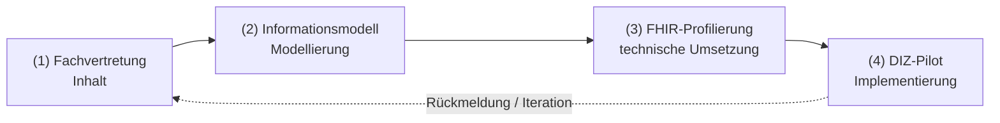

# ROLES.md — Perspektiven & Rollen in der Modulentwicklung

Die Entwicklung eines MII-KDS-Moduls verteilt sich auf **vier Stakeholder-
Perspektiven**. Dieses Dokument ordnet jeder Rolle ihre Aufgaben, Lesepfade,
Ein-/Ausgaben und das passende **Verständlichkeitsniveau** zu und beschreibt die
Übergaben zwischen den Rollen.

## Entwicklungsfluss (mit Rückkopplung)

## Rollen im Detail

### (1) Fachvertretung — inhaltlich
- **Aufgabe:** fachliche Anforderungen, Datenelemente und Anwendungsfälle festlegen;
  klinisch-fachliche Korrektheit und Vollständigkeit verantworten.
- **Lesepfad (Einstieg):** [`index.md`](input/pagecontent/index.md) (Beschreibung/Scope) → [`use-cases.md`](input/pagecontent/use-cases.md)
  (Szenarien) → [`data-sets.md`](input/pagecontent/data-sets.md) (Datenelemente in fachlicher Sprache).
- **Liefert:** Use Cases, Datenelement-Liste mit Bedeutung, fachliche Freigabe.
- **Verständlichkeit:** **nicht-technisch**. Kommt ohne FHIR/FSH aus; Narrative ist
  deutsch geführt. FHIR-Profile/Code sind hier **nicht** erforderlich.
- **Beteiligung:** Issue-Template „Kommentar / Ballot-Eintrag" (Kommentar-Typ +
  Begründung), Kommentierungsphase (siehe [`COMMENT_RESOLUTION.md`](COMMENT_RESOLUTION.md)).

### (2) Informationsmodell — Modellierung
- **Aufgabe:** fachliche Elemente in ein formales **Logical Model** überführen
  (Kardinalitäten, Datentypen, Beziehungen); Rückverfolgbarkeit sichern.
- **Lesepfad:** [`uml.md`](input/pagecontent/uml.md) → Logical Model `mii-lm-beispiel-modell` →
  [`data-sets.md`](input/pagecontent/data-sets.md) inkl. **Model-to-Profile-Mapping**.
- **Liefert:** Logical Model, Mapping-Tabelle Datenelement → Modell → Profil.
- **Verständlichkeit:** **semi-technisch** (UML/Logical Model), noch unabhängig von
  konkreten FHIR-Ressourcen.

### (3) Technische Umsetzung — FHIR-Profilierung
- **Aufgabe:** Modell in FHIR-**Profile/Extensions/Terminologien/CapabilityStatement**
  übersetzen; Beispiele, QC und Build verantworten.
- **Lesepfad:** [`input/fsh/`](input/fsh/) (profile/extension/valueset/codesystem) →
  [`conformance.md`](input/pagecontent/conformance.md) → [`DESIGN.md`](DESIGN.md) → [`qc/custom.rules.yaml`](qc/custom.rules.yaml) → [`MIGRATION.md`](MIGRATION.md),
  [`AGENTS.md`](AGENTS.md).
- **Liefert:** FHIR-Profile, valide Beispiele, IG-Build (`qa.html` 0 Errors),
  bestandene QC.
- **Verständlichkeit:** **technisch** (FSH/SUSHI/IG Publisher, FHIRPath).

### (4) DIZ-Pilot — Implementierung/Erprobung
- **Aufgabe:** den IG in einem Datenintegrationszentrum implementieren und erproben;
  Umsetzbarkeit, Datenverfügbarkeit und Performanz zurückmelden.
- **Lesepfad:** [`conformance.md`](input/pagecontent/conformance.md) (Must Support, fehlende Daten, Such-API) →
  `CapabilityStatement` → Downloads (`package.tgz`/`full-ig.zip`) → Beispiele →
  [`PUBLISHING.md`](PUBLISHING.md), [`NOTIFICATIONS.md`](NOTIFICATIONS.md).
- **Liefert:** Implementierungs-Feedback, Validierungsergebnisse (Test-/Echtdaten),
  Issues; Bestätigung der Umsetzbarkeit.
- **Verständlichkeit:** **technisch-implementierend**; benötigt stabile Canonicals,
  Versionierung, Downloads und Update-Feeds.

## Rollen-zu-Artefakt-Matrix

| Artefakt / Seite | (1) Fach | (2) Modell | (3) FHIR | (4) DIZ |
|------------------|:-------:|:----------:|:--------:|:-------:|
| [`index.md`](input/pagecontent/index.md) (Beschreibung/Scope) | ● | ● | ○ | ○ |
| [`use-cases.md`](input/pagecontent/use-cases.md) | ● | ● | ○ | ○ |
| [`data-sets.md`](input/pagecontent/data-sets.md) (+ Mapping) | ● | ● | ● | ○ |
| [`uml.md`](input/pagecontent/uml.md) / Logical Model | ○ | ● | ● | ○ |
| [`input/fsh/`](input/fsh/) (Profile etc.) |  | ○ | ● | ○ |
| [`conformance.md`](input/pagecontent/conformance.md) (Must Support, Such-API) |  | ○ | ● | ● |
| [`security-privacy.md`](input/pagecontent/security-privacy.md) |  |  | ● | ● |
| `CapabilityStatement` |  |  | ● | ● |
| Downloads / `package.tgz` |  |  | ○ | ● |
| [`qc/`](qc/), [`DESIGN.md`](DESIGN.md), [`MIGRATION.md`](MIGRATION.md) |  |  | ● | ○ |
| [`PUBLISHING.md`](PUBLISHING.md), [`NOTIFICATIONS.md`](NOTIFICATIONS.md) |  |  | ○ | ● |
| [`changes.md`](input/pagecontent/changes.md) (Release Notes) | ○ | ○ | ● | ● |

● = primär zuständig/relevant · ○ = unterstützend/zur Kenntnis

## Verständlichkeit & Übergaben (Brücken-Artefakte)
- **Fach → Modell:** [`data-sets.md`](input/pagecontent/data-sets.md) (Datenelemente fachlich) + [`use-cases.md`](input/pagecontent/use-cases.md).
- **Modell → FHIR:** **Model-to-Profile-Mapping** in `data-sets.md` und das
  Logical Model — die zentrale Brücke zwischen Modellierung und Profilierung.
- **FHIR → DIZ:** [`conformance.md`](input/pagecontent/conformance.md), `CapabilityStatement`, Downloads, Beispiele.
- **Sprachpolitik als Verständlichkeitsmittel:** Narrative deutsch geführt (für Fach
  und Modellierung), FHIR-Artefakt-Bezeichner englisch (für Technik/DIZ) — siehe KDS-Governance.
- **Hinweis:** Jede narrative Seite trägt am Kopf eine Zeile „Relevant für: …",
  damit der Lesepfad je Rolle unmittelbar erkennbar ist.
