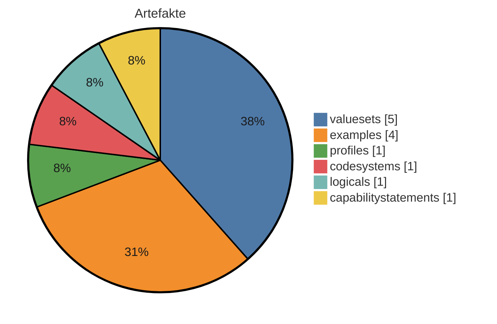
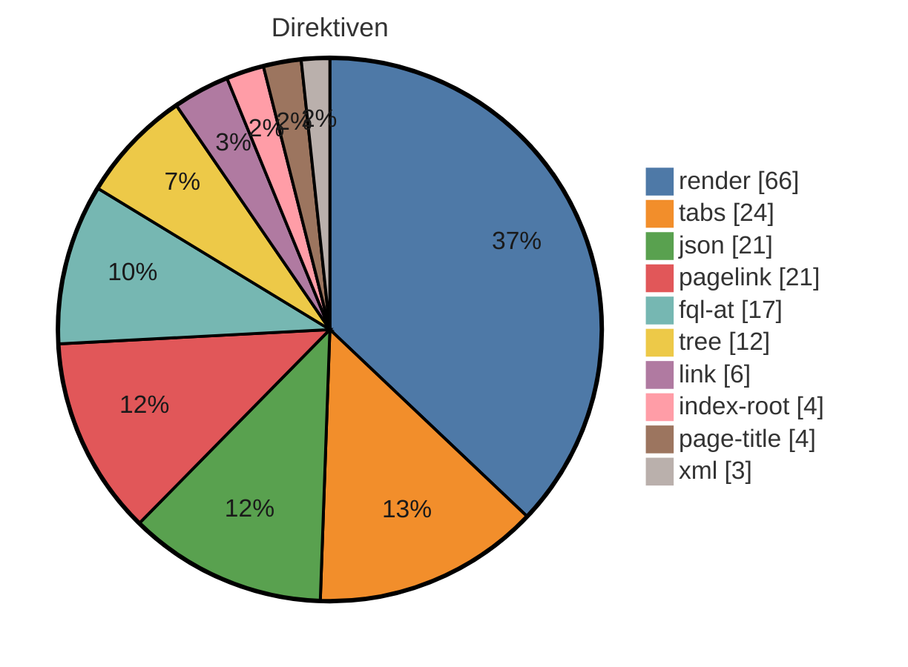

# IG-Statistik — MII KDS Diagnose v2025.0.1

_Modus: `static` · Stand: 2026-06-26T22:32:28Z · Commit: `c2d2ff4`_

## Executive Summary: Migration des FHIR-Leitfadens "MII IG Diagnose"

> **Worum geht es?** Ein FHIR Implementation Guide (kurz „IG“) ist die technische Spezifikation eines Datenstandards im Gesundheitswesen – das Regelwerk plus die zugehörige Online-Dokumentation. Dieser IG soll von einer herstellergebundenen Plattform auf das herstellerneutrale Standard-Werkzeug der FHIR-Community (den „IG Publisher“) umgezogen werden. Inhaltlich ändert sich nichts – nur die technische Bauweise der Veröffentlichung. _Fachbegriffe sind im Glossar am Dokumentende erklärt._

### Das Wichtigste in einem Satz

Der Umzug ist **umfangreich** (geschätzt **51–83 Personenstunden**, also rund **6,4–10,3 Personentage**), **mit wenigen vorab zu klärenden Punkten** – die fachliche Substanz liegt bereits in maschinenlesbarer, sauberer Form vor. Mit KI-Unterstützung lässt sich der Aufwand voraussichtlich deutlich senken (modellierte ~30–49 h, ≈ 41 % weniger; Annahmen und Vorbehalte siehe „Aufwand“).

### Inhaltlicher Umfang (was migriert wird)

- **Identität:** `mii-ig-diagnose`, Version 2025.0.1, Herausgeber Medizininformatik Initiative, Lizenz CC-BY-4.0, Status „active“.
- **13 fachliche Bausteine:** 1 Profil (Kernregelwerk), 5 Werte-Listen, 1 Codesystem, 1 logisches Datenmodell, 1 Fähigkeitsbeschreibung, 4 Beispiele.
- **Dokumentation:** 52 inhaltliche Textseiten (~38118 Wörter, Ø 733 Wörter/Seite) und 19 Bilder.

### Aufwand und was das Band bedeutet

- **Aufwandsband: L (groß)** – auf einer Skala S (klein, <1 Tag) / M (mittel, einige Tage) / L (groß, 1–2 Wochen) / XL (sehr groß) liegt dieses Vorhaben **im oberen Bereich**.
- **Manuell: rund 51–83 Stunden.** Das ist eine **Größenordnungsschätzung zur Budgetplanung** (Faustregel: Menge der Arbeitsschritte × Erfahrungswert) – **kein verbindliches Angebot**.
- **KI-gestützt teilautomatisiert: rund 30–49 Stunden** (≈ 41 % weniger). Das heißt: eine KI erledigt die wiederkehrenden Umbauten, Menschen prüfen und geben an Kontrollpunkten frei (Human-in-the-Loop / Review-Gates). Die Schätzung gilt **unabhängig davon, welches KI-Produkt eingesetzt wird** – sie ist eine _modellierte_ Annahme mit noch nicht kalibrierten Faktoren, **keine garantierte Einsparung**.
- **Größte Aufwandstreiber:** 178 plattformspezifische Platzhalter in den Textseiten (sog. „Direktiven“ – das neue Standard-Werkzeug kennt sie nicht, sie werden einzeln umgebaut; ~36 h) und 52 Inhaltsseiten (~26 h).
- **Reife & Strategie:** Reifegrad **74/100 (fortgeschritten)** · Hersteller-Lock-in mittel. (Details in den Abschnitten Reife & Freigabe und Strategie.)

### Wie sauber ist die Quelle?

- **Regeln liegen bereits in der bearbeitbaren Textform (FSH) vor – kein aufwändiger Rückbau nötig (Effizienzvorteil).**
- **3 externe Abhängigkeiten, davon 1 fest verankert, 2 beweglich.** Bewegliche Versionen vor der Migration auf feste Stände festlegen.
- **Versionsnummer aus dem Kalenderjahr (CalVer)** – wird unverändert übernommen, kein Anpassungsbedarf.
- **Mehrsprachigkeit bereits technisch vorbereitet** – Übersetzungen können automatisch mitgenommen werden.
- **9 Qualitätsregeln** bereits definiert und 1:1 übernehmbar.

### Risiken und Blocker

- **Zu klären vor Start: bewegliche Abhängigkeiten (vor Migration fixieren).**
- **Schätzungs-Vorbehalt:** beruht auf einer rein **statischen** Analyse der Quelldateien (ohne Test-Build); ein vollständiger Validierungslauf kann zusätzliche Detailkorrekturen aufdecken. Die Erfahrungswerte sind noch nicht final kalibriert – daher die bewusst breite Spanne.
- **Risikomindernd:** Der Umzug erfolgt isoliert auf einem separaten Arbeitszweig, ohne Eingriff in den produktiven Stand; ein menschliches Abschluss-Review ist vorgesehen.

### Bottom Line / Empfehlung

**Durchführbar – mit Ressourcen- und Zeitplanung.** Der Aufwand ist groß und kalkulierbar (manuell ~6,4–10,3 Personentage, KI-gestützt voraussichtlich spürbar weniger), die Quelle ist mit überschaubaren Vorarbeiten. Konkret einzuplanen: ein abschließender Validierungslauf mit fachlichem Review.

## Kennzahlen-Überblick

### Artefakte (Σ 13 publiziert)

_Hier wird gezählt, wie viele FHIR-Bausteine (Profile, Extensions, ValueSets usw.) der IG je Typ definiert._

<div align="center">



</div>

<div align="center">

| Typ | Anzahl |
|---|---|
| valuesets | 5 |
| examples | 4 |
| profiles | 1 |
| codesystems | 1 |
| logicals | 1 |
| capabilitystatements | 1 |

</div>

_Interne FSH-Konstrukte (nicht in Σ): 18 rulesets, 2 mappings._

### Plattform-Direktiven — Σ 178 (unbekannt: 0)

_Dieser Abschnitt listet die plattformspezifischen Platzhalter in den Erklärseiten, die ein generischer IG Publisher nicht versteht und die daher umgesetzt werden müssen._

<div align="center">



</div>

<div align="center">

| Direktive | Anzahl |
|---|---|
| render | 66 |
| tabs | 24 |
| json | 21 |
| pagelink | 21 |
| fql-at | 17 |
| tree | 12 |
| link | 6 |
| index-root | 4 |
| page-title | 4 |
| xml | 3 |

</div>

## Inhaltsumfang & Repo-Hygiene

_Linguistische Kennzahlen zum Textumfang (Wörter je Seite, Durchschnitt) sowie Hinweise auf inhaltliche Dopplungen und nicht referenzierte Dateien (Dead-Code-Analogie) - hilft, Umfang und Aufräumpotenzial einzuschätzen._

<div align="center">

| Kennzahl | Wert |
|---|---|
| Enthaltene IG-Ordner | 5 |
| Inhalts-Seiten | 52 |
| Wörter gesamt | 38118 |
| Ø Wörter / Seite | 733 |
| Median Wörter / Seite | 448 |
| Unterstützte Sprachen | 2 (de, en) |
| kürzeste / längste Seite | 22 / 4362 Wörter |
| doppelte Inhaltsblöcke | 292 (davon 292 ordnerübergreifend) |
| identische Seiten (Gruppen) | 15 |
| Bilder nicht referenziert | 5 von 19 |
| Beispiele nicht in Narrativen | 0 von 4 |

</div>

**Enthaltene IG-Ordner (5) — Aufschlüsselung je IG (Spalten: aktuell → ältest):**

<div align="center">

| Kennzahl | 2025 | 2024.x-DE | 2024.x-EN | 1.x-DE | 1.x-EN |
|---|---|---|---|---|---|
| Sprache | ? | de | en | de | en |
| Inhalts-Seiten | 12 | 12 | 10 | 8 | 10 |
| Wörter | 7807 | 7629 | 8129 | 6580 | 8046 |
| Ø Wörter / Seite | 651 | 636 | 813 | 822 | 805 |
| Direktiven | 50 | 50 | 38 | 18 | 22 |
| Aufwand manuell ~h (je IG) | 12,8–20,8 | 12,8–20,8 | 10,1–16,4 | 6,1–9,9 | 7,5–12,2 |

</div>

> ⚠ Das Repo enthält **5 IG-Ordner** (Versions-/Sprachvarianten). Aggregat-Kennzahlen (Direktiven, Wörter, **Aufwand**) summieren über **alle** Ordner — für die Migration **einer** Version entsprechend nach unten zu korrigieren; die 292 ordnerübergreifenden Dopplungen zeigen das Ausmaß.

_Heuristik: 'nicht referenziert' = Dateiname/Artefaktname kommt in keiner Erklärseite vor. Kein Beweis für Ungenutztheit (Referenz kann über Konfiguration/Build erfolgen)._

## Aufwand: manuell vs. KI-gestützt

_Dieser Abschnitt schätzt den Arbeitsaufwand der Überführung als Spanne - manuell und KI-gestützt teilautomatisiert - abgeleitet aus zählbaren Treibern und Stundenfaktoren._

<div align="center">

| Treiber | Menge | manuell [h] | KI-gestützt [h] |
|---|---|---|---|
| Direktiven (bekannt) | 178 | 35,6 | 14,2 |
| Inhalts-Seiten | 52 | 26 | 10,4 |
| Floating Pins (Versionen fixieren) | 2 | 2 | 1,6 |
| GoFSH-Vorlauf (Regel-Rückgewinnung) | nein | 0 | 0 |
| Direktiven (unbekannt → manuell) | 0 | 0 | 0 |
| Einarbeitung/Setup (einmalig) | — | 0 | 3 |
| Review-Gates (Pauschale) | — | 0 | 3 |
| Validierungs-/Iterationsaufschlag (20 %) | — | 0 | 5,2 |

</div>

**Manuell:** Band L · **50,9–82,7 h**  |  **KI-gestützt (HITL, Review-Gates, anbieter-/modellunabhängig):** Band L · **30–48,7 h** · **≈ 41 % weniger**

_Annahmen:_ • Nur statisch berechenbare Treiber; id/url-Mismatch, QC-Verletzungen und quell-intrinsische Validierungsfehler erfordern einen Build und sind hier nicht enthalten. • Faktoren sind Erfahrungswerte, noch nicht final kalibriert; Spanne = Basis × 0,8…1,3. • pages = Inhalts-Seiten (Stubs/Navigation < 20 Wörter ausgeschlossen). • Personentage = Aufwand in 8-h-Arbeitstagen (1 PT = 8 Personenstunden); beide Schätzungen messen MENSCHLICHE Arbeitszeit — manuell die Migration von Hand, KI-gestützt die Bedien-/Review-Zeit der KI (Prompts, Review-Gates, Korrekturen), NICHT die Rechen-/Laufzeit oder Wartezeit der KI. • KI-Schätzung: anbieter-/modellunabhängig (Human-in-the-Loop, Review-Gates). Enthält feste Pauschalen für Einarbeitung/Setup (3 h) und Review-Gates (3 h) sowie einen Validierungs-/Iterationsaufschlag (20 %); unbekannte Direktiven werden wie manuell gerechnet. Bewusst konservativ – keine garantierte Einsparung.

## Reife & Freigabe

_Verdichteter Reifegrad als Freigabe-Indikator: Status, Vollständigkeit der Dokumentation, Beispiel-Abdeckung der Profile und Governance-Reife._

<div align="center">

| Komponente | Wert |
|---|---|
| **Reifegrad-Score** | **74/100 (fortgeschritten)** |
| Status | active |
| Doku-Vollständigkeit (Inhalt vs. Stubs) | 85 % |
| Beispiel-Abdeckung Profile | 100 % (1/1) |
| Governance (CI · ig.ini · publication · devcontainer) | 25/100 |

</div>

## Strategie: Wiederverwendung, Lock-in & Zukunftssicherheit

_Strategische Kennzahlen: Bindung an die Quellplattform (Lock-in), Anteil standardisierter Terminologie, Wiederverwendung externer Bausteine und Zukunftssicherheit (FHIR-Version, Pflege-Aktivität)._

<div align="center">

| Kennzahl | Wert |
|---|---|
| Hersteller-Lock-in | 41/100 (mittel) · 3,4 Direktiven/Seite |
| Standard-Terminologie-Anteil | 100 % (SNOMED CT, ICD-10) |
| Wiederverwendung externer Profile (Parents) | 100 % (1 von 1 Profil-Parents extern; abstrakte LM-Basistypen ausgeschlossen) |
| FHIR-Version | R4 — aktuell verbreitet |
| Dependency-Veraltung | 0 veraltet (Heuristik) |
| Pflege-Kadenz | 53.4 Commits/Jahr · letzter Commit vor 250 Tagen |

</div>

_Lock-in und Standard-Terminologie-Anteil sind grobe Heuristiken aus Textvorkommen. Heuristik aus CalVer-Jahr; exakt nur via Package-Registry (extern)._

## Planung & Terminierung

_Planungsgrößen jenseits reiner Personenstunden: Kalenderzeit, Szenarien (Min/Erwartet/Max), Schätz-Konfidenz, Startbereitschaft und grober Rollen-Mix._

<div align="center">

| Planungsgröße | Wert |
|---|---|
| Kalenderzeit | 11–18 Arbeitstage |
| Szenario Min / Erwartet / Max | 50,9 / 66,8 / 82,7 h |
| Schätz-Konfidenz | mittel |
| Startbereitschaft | 90/100 |
| Cross-Modul-Abhängigkeit | erhöht (floating Pins) |
| KI-Fixaufwandsanteil | 12 % |

</div>

**Rollen-Mix (grob):** FSH-Rückgewinnung/Pins 3 % · Template/Tooling (Direktiven) 56 % · Redaktion/Doku (Seiten) 41 %. Direktiven & Seiten gut parallelisierbar; Setup/QA seriell.

_Hinweis: FHIR-/FSH-Fachwissen ist für Review, Validierung und QC-Übernahme generell erforderlich; ein 0-%-Wert bei FSH bedeutet nur, dass **kein FSH-Rückbau (GoFSH)** anfällt. Annahmen Kalenderzeit: 8 h/Tag · Team 1 · Auslastung 60 %._

## Risiko & Compliance

_Entscheidungsrelevante Risiken für die Freigabe: Terminologie-Lizenzen, unterdrückte Warnungen, Datenschutz-Substanz, Wissenskonzentration (Bus-Faktor) und Kompatibilitätsbruch zur Vorversion._

<div align="center">

| Risiko | Bewertung |
|---|---|
| Terminologie-Lizenz | Lizenzbedarf möglich — SNOMED CT: lizenzpflichtig (Affiliate/Land), ICD-10: frei |
| Unterdrückte QA-Warnungen | 0 (davon 0 breit) → keine |
| Datenschutz-Seite (Substanz) | fehlt/nur Stub (0 Wörter) |
| PII-artige Beispieldaten | keine erkannt |
| Bus-Faktor (Wissenskonzentration) | 34 % Top-Autor → gering |
| Breaking-Change-Risiko ggü. Vorversion | — (nur per Build/Vorversions-Diff) |

</div>

## Empfehlungen für die Überführung in ein generisches HL7-FHIR-IG

_Hier stehen je Themenbereich konkrete, aus den Kennzahlen abgeleitete Schritte, um den IG in das generische HL7-FHIR-IG-Format zu überführen._

<div align="center">

| Bereich | Befund | Empfehlung |
|---|---|---|
| Artefakte (FSH) | 13 publiziert, FSH vorhanden | Liegen die Artefakte bereits als FSH vor, können sie unverändert nach input/fsh/ übernommen werden; ein Rückwandeln aus fertigen FHIR-Dateien entfällt. Wichtig: ids und Canonical-URLs bleiben gleich, damit bestehende Verweise weiter funktionieren (Bestandsschutz). |
| Narrative | 52 Inhalts-Seiten, Format source | Die frei geschriebenen Erklärseiten gehören als Markdown-Dateien nach input/pagecontent/. Reine Platzhalter-/Navigationsseiten werden nicht übernommen, da Navigation und Inhaltsverzeichnis automatisch entstehen. |
| Direktiven | 178 (0 unbekannt) | Plattformspezifische Platzhalter/Tags werden durch die passenden Mechanismen des IG Publishers ersetzt (meist Vorlagen-Includes oder normale Markdown-Konstrukte). Direktiven ohne bekanntes Gegenstück werden einzeln von Hand geprüft und sinnvoll übersetzt. |
| Dependencies | 3 (2 floating) | Alle deklarierten Paket-Abhängigkeiten werden mit fester Version in die sushi-config.yaml übernommen. Feste Versionen (Pinning) sind reproduzierbaren Builds vorzuziehen; bewegliche Einträge werden auf eine konkrete Version festgelegt. |
| Mehrsprachigkeit | FSH-Übersetzung ja, Supplements 0 | In Ressourcen eingebettete Übersetzungen werden vom Build automatisch in die jeweilige Sprachausgabe übernommen. Für übersetzte Erklärseiten legt man pro Sprache eigene Seiten an; eine Sprache bleibt führend, jede maschinelle Übersetzung ist menschlich zu prüfen. |
| Pflichtseiten | 0/11 im Zielformat | Das Standard-Seitenraster sollte vollständig vorhanden sein (z.B. Startseite, Anwendungsfälle, Datensätze, Konformität, Kontext, Referenzen, Änderungen, Downloads, Datenschutz, Übersetzungshinweis). Fehlende Zielseiten werden ergänzt und in die Seiten-/Menükonfiguration aufgenommen. |
| QC-Regeln | 9 definiert | Die im Quellprojekt definierten Qualitätsregeln (qc/custom.rules.yaml) werden übernommen und in der CI-Pipeline regelmäßig ausgeführt, damit Validierung und Namenskonventionen automatisch geprüft werden. |
| Metadaten/Config | id mii-ig-diagnose, v2025.0.1 | Die Kerndaten des IG (id, Version, Status, Publisher, Lizenz) werden in sushi-config.yaml und ig.ini ins Zielformat überführt, inklusive Seiten-, Menü- und Sprachkonfiguration; die gewünschte Zielversion wird gesetzt. |
| Arbeitsweise | — | Die Migration findet isoliert auf einem eigenen Arbeitszweig statt, getrennt vom Hauptstand. Änderungen werden über einen Pull Request eingebracht und vor dem Zusammenführen menschlich geprüft, statt direkt auf den Hauptzweig zu schreiben. |

</div>

## Direktiven-Mapping (Detail)

_Dieser Abschnitt ordnet jedem Direktiven-Typ sein Gegenstück im IG-Publisher-Format zu, sortiert nach Häufigkeit._

<div align="center">

| Direktive | Anzahl | Was es tut | Empfehlung (→ IG Publisher) |
|---|---|---|---|
| render | 66 | Bindet generierten Inhalt ein - ein Bild/Grafik oder eine vollständige FHIR-Ressource (z.B. CapabilityStatement). | Bild: nach input/images/ kopieren und als Markdown-/HTML-Bild einbinden. Ressource/Artefakt: meist entfernen (der IG Publisher erzeugt je Artefakt automatisch eine Seite) ODER das passende vorgefertigte Anzeige-Fragment einbinden. |
| tabs | 24 | Gruppiert mehrere Inhalte (z.B. Darstellung, XML, JSON) in umschaltbare Reiter. | Die einzelnen Reiterinhalte durch die jeweils passenden generierten Anzeige-Fragmente (Struktur, XML, JSON) ersetzen; eine eigene Reiter-Mechanik ist meist nicht nötig. |
| json | 21 | Zeigt eine Ressource oder ein Beispiel in JSON-Darstellung an. | Durch das vom IG Publisher erzeugte JSON-Anzeige-Fragment ersetzen. |
| pagelink | 21 | Erzeugt einen Verweis auf eine andere Seite oder ein Artefakt anhand eines Namens-Hinweises. | Durch einen normalen Markdown-Link auf die generierte Artefaktseite ersetzen (Form Typ-id.html); der Artefaktname wird in die kleingeschriebene id umgesetzt. |
| fql-at | 17 | Markiert einen Abfrage-Codeblock in besonderer Schreibweise (mit @-Präfix). | Wie einen normalen Abfrageblock behandeln und durch ein generiertes Tabellen-Fragment oder eine statische Tabelle ersetzen. |
| tree | 12 | Zeigt die Struktur eines Profils/einer Extension als aufklappbaren Strukturbaum an. | Durch das vom IG Publisher erzeugte Struktur-Fragment ersetzen (Snapshot- oder Differential-Ansicht bzw. Element-Wörterbuch). |
| link | 6 | Erzeugt einen Verweis auf ein einzelnes Artefakt (z.B. dessen Übersichtsseite). | Durch einen normalen Markdown-Link auf die generierte Artefaktseite ersetzen (Form Typ-id.html). |
| index-root | 4 | Erzeugt an dieser Stelle ein automatisches Inhaltsverzeichnis bzw. die Wurzel der Navigationsstruktur. | Entfällt - Navigation und Inhaltsverzeichnis erzeugt der IG Publisher selbst aus der konfigurierten Seitenstruktur. |
| page-title | 4 | Setzt an dieser Stelle den Titel der Seite, der aus den Seiteneinstellungen gezogen wird. | Entfällt ersatzlos - Seitentitel und Überschrift steuert man zentral über die Seiten- und Menükonfiguration. |
| xml | 3 | Zeigt eine Ressource oder ein Beispiel in XML-Darstellung an. | Durch das vom IG Publisher erzeugte XML-Anzeige-Fragment ersetzen. |

</div>

# Anhang: Detailaufschlüsselung

_Im Anhang steht jeder Einzelwert mit seiner Quelle, damit man die Kennzahlen nachvollziehen kann, ohne im Projekt suchen zu müssen._

## Identität & Herkunft

_Kerndaten des IG (Kennungen, Version, Status, Herausgeber) und woher sie stammen._

<div align="center">

| Feld | Wert | Quelle |
|---|---|---|
| id | mii-ig-diagnose | sushi-config.yaml / package.json |
| canonical | https://www.medizininformatik-initiative.de/fhir/core/modul-diagnose | sushi-config.yaml / package.json |
| packageId | de.medizininformatikinitiative.kerndatensatz.diagnose | sushi-config.yaml / package.json |
| name | MII_IG_Diagnose | sushi-config.yaml / package.json |
| title | MII IG Diagnose | sushi-config.yaml / package.json |
| version | 2025.0.1 | sushi-config.yaml / package.json |
| status | active | sushi-config.yaml / package.json |
| fhirVersion | 4.0.1 | sushi-config.yaml / package.json |
| license | CC-BY-4.0 | sushi-config.yaml / package.json |
| publisher | Medizininformatik Initiative | sushi-config.yaml / package.json |
| calver | True | version-Regex |

</div>

## Dependencies

_Die FHIR-Pakete, auf denen der IG aufbaut, samt Version und ob diese fest oder offen angegeben ist._

<div align="center">

| Package | Version | Pin |
|---|---|---|
| de.basisprofil.r4 | 1.5.x | floating ⚠ |
| de.medizininformatikinitiative.kerndatensatz.meta | 2025.0.x | floating ⚠ |
| kbv.all.st | 1.27.0 | gepinnt |

</div>

## Artefakte (Quelle: input/fsh (FSH-Deklarationen))

_Jedes definierte Artefakt mit Typ, Name und Fundort in den Quelldateien._

<div align="center">

| Typ | Name | InstanceOf | Quelle |
|---|---|---|---|
| RuleSet | SupportResource |  | input/fsh/capabilitystatements/CapabilityStatement.fsh:3 |
| RuleSet | Profile |  | input/fsh/capabilitystatements/CapabilityStatement.fsh:14 |
| RuleSet | SupportProfile |  | input/fsh/capabilitystatements/CapabilityStatement.fsh:19 |
| RuleSet | SupportInteraction |  | input/fsh/capabilitystatements/CapabilityStatement.fsh:25 |
| RuleSet | SupportSearchParam |  | input/fsh/capabilitystatements/CapabilityStatement.fsh:31 |
| RuleSet | SupportSpecialSearchParam |  | input/fsh/capabilitystatements/CapabilityStatement.fsh:39 |
| Instance | mii-cps-diagnose-capabilitystatement | CapabilityStatement | input/fsh/capabilitystatements/CapabilityStatement.fsh:46 |
| CodeSystem | MII_CS_Diagnose_Lebensphase_Supplement_SNOMED |  | input/fsh/codesystems/mii-cs-diagnose-lebensphase-supplement-snomed.fsh:1 |
| Instance | mii-exa-diagnose-condition-minimal | MII_PR_Diagnose_Condition | input/fsh/instances/mii-exa-diagnose-condition-minimal.fsh:1 |
| Instance | mii-exa-diagnose-mehrfachkodierung-primaercode | MII_PR_Diagnose_Condition | input/fsh/instances/mii-exa-diagnose-mehrfachkodierung-primaercode.fsh:1 |
| Instance | mii-exa-diagnose-mehrfachkodierung-sekundaercode | MII_PR_Diagnose_Condition | input/fsh/instances/mii-exa-diagnose-mehrfachkodierung-sekundaercode.fsh:1 |
| Instance | mii-exa-diagnose-multiple-kodierungen | MII_PR_Diagnose_Condition | input/fsh/instances/mii-exa-diagnose-multiple-kodierungen.fsh:1 |
| Logical | MII_LM_Diagnose |  | input/fsh/logicals/MII_LM_Diagnose.fsh:1 |
| Mapping | Diagnose-LogicalModel |  | input/fsh/logicals/MII_LM_Diagnose.fsh:39 |
| Profile | MII_PR_Diagnose_Condition |  | input/fsh/profiles/MII_PR_Diagnose_Condition.fsh:1 |
| Mapping | FHIR-LogicalModel |  | input/fsh/profiles/MII_PR_Diagnose_Condition.fsh:161 |
| RuleSet | LicenseCodeableCCBY40 |  | input/fsh/rulesets/license-terms.fsh:3 |
| RuleSet | LicenseCodeableCCBY40Instance |  | input/fsh/rulesets/license-terms.fsh:7 |
| RuleSet | MetaProfile |  | input/fsh/rulesets/meta-profile.fsh:1 |
| RuleSet | Publisher |  | input/fsh/rulesets/publisher.fsh:1 |
| RuleSet | SP_Publisher |  | input/fsh/rulesets/publisher.fsh:6 |
| RuleSet | Translation |  | input/fsh/rulesets/translation.fsh:1 |
| RuleSet | AddSnomedCodingTranslation |  | input/fsh/rulesets/translation.fsh:8 |
| RuleSet | AddIcd10CodingTranslation |  | input/fsh/rulesets/translation.fsh:16 |
| RuleSet | AddAlphaIdCodingTranslation |  | input/fsh/rulesets/translation.fsh:24 |
| RuleSet | AddOrphaCodingTranslation |  | input/fsh/rulesets/translation.fsh:32 |
| RuleSet | Version |  | input/fsh/rulesets/version.fsh:2 |
| RuleSet | PR_CS_VS_Version |  | input/fsh/rulesets/version.fsh:5 |
| ValueSet | MII_VS_Diagnose_DiagnoseCodes_SNOMED |  | input/fsh/valuesets/MII_VS_Diagnose_DiagnoseCodes_SNOMED.fsh:1 |
| ValueSet | MII_VS_Diagnose_AlphaID |  | input/fsh/valuesets/mii-vs-diagnose-alphaid.fsh:1 |
| ValueSet | MII_VS_Diagnose_BodyStructure_SNOMED |  | input/fsh/valuesets/mii-vs-diagnose-bodysite-snomed.fsh:1 |
| ValueSet | MII_VS_Diagnose_ICD10GM |  | input/fsh/valuesets/mii-vs-diagnose-icd-10-gm.fsh:1 |
| ValueSet | MII_VS_Diagnose_Orphanet |  | input/fsh/valuesets/mii-vs-diagnose-orphanet.fsh:1 |

</div>

## Narrative-Seiten (52 Inhalt / 61 gesamt)

_Die Erklärseiten des IG mit Umfang und der Angabe, ob es sich um Inhalts- oder reine Platzhalterseiten handelt._

<div align="center">

| Datei | Wörter | Format | Stub? |
|---|---|---|---|
| implementation-guides/ImplementationGuide-1.x-EN/Description.guide.md | 4362 | source |  |
| implementation-guides/ImplementationGuide-2024.x-EN/MIIIGModulDiagnoseEN/Description.guide.md | 4362 | source |  |
| implementation-guides/ImplementationGuide-1.x-DE/BeschreibungModul.guide.md | 3862 | source |  |
| implementation-guides/ImplementationGuide-2024.x-DE/MIIIGModulDiagnose/BeschreibungModul.page.md | 3855 | source |  |
| implementation-guides/ImplementationGuide-2025/MIIIGModulDiagnose/BeschreibungModul.page.md | 3855 | source |  |
| implementation-guides/ImplementationGuide-2025/MIIIGModulDiagnose/TechnischeImplementierung/FHIRProfile/Diagnose-Condition.page.md | 901 | source |  |
| implementation-guides/ImplementationGuide-2024.x-DE/MIIIGModulDiagnose/TechnischeImplementierung/FHIRProfile/Diagnose-Condition.page.md | 898 | source |  |
| implementation-guides/ImplementationGuide-1.x-EN/Context.guide.md | 817 | source |  |
| implementation-guides/ImplementationGuide-2024.x-EN/MIIIGModulDiagnoseEN/Context.guide.md | 817 | source |  |
| implementation-guides/ImplementationGuide-2024.x-DE/MIIIGModulDiagnose/KontextimGesamtprojektBezgezuanderenModulen.page.md | 736 | source |  |
| implementation-guides/ImplementationGuide-2025/MIIIGModulDiagnose/KontextimGesamtprojektBezgezuanderenModulen.page.md | 736 | source |  |
| implementation-guides/ImplementationGuide-1.x-DE/KontextimGesamtprojektBezgezuanderenModulen.guide.md | 733 | source |  |
| implementation-guides/ImplementationGuide-1.x-EN/UseCases/Datasets.guide.md | 705 | source |  |
| implementation-guides/ImplementationGuide-2024.x-EN/MIIIGModulDiagnoseEN/UseCases/Datasets.guide.md | 705 | source |  |
| implementation-guides/ImplementationGuide-2024.x-EN/MIIIGModulDiagnoseEN/Technicalimplementation/FHIRprofiles/Condition.guide.md | 621 | source |  |
| implementation-guides/ImplementationGuide-1.x-DE/AnwendungsflleInformationsmodell/Datenstzeinkl.Beschreibungen.guide.md | 606 | source |  |
| implementation-guides/ImplementationGuide-1.x-EN/UseCases/Scenariodescription.guide.md | 561 | source |  |
| implementation-guides/ImplementationGuide-2024.x-EN/MIIIGModulDiagnoseEN/UseCases/Scenariodescription.guide.md | 561 | source |  |
| implementation-guides/ImplementationGuide-1.x-EN/Technicalimplementation/FHIRprofiles/Condition.guide.md | 546 | source |  |
| implementation-guides/ImplementationGuide-2025/MIIIGModulDiagnose/Release-Notes.page.md | 528 | source |  |
| implementation-guides/ImplementationGuide-1.x-DE/TechnischeImplementierung/FHIRProfile/Condition.guide.md | 504 | source |  |
| implementation-guides/ImplementationGuide-2024.x-DE/MIIIGModulDiagnose/AnwendungsflleInformationsmodell/BeschreibungvonSzenarienfrdieAnwendungderModule.page.md | 495 | source |  |
| implementation-guides/ImplementationGuide-2025/MIIIGModulDiagnose/AnwendungsflleInformationsmodell/BeschreibungvonSzenarienfrdieAnwendungderModule.page.md | 495 | source |  |
| implementation-guides/ImplementationGuide-1.x-DE/AnwendungsflleInformationsmodell/BeschreibungvonSzenarienfrdieAnwendungderModule.guide.md | 492 | source |  |
| implementation-guides/ImplementationGuide-1.x-EN/Index.guide.md | 479 | source |  |
| implementation-guides/ImplementationGuide-2024.x-EN/MIIIGModulDiagnoseEN/Index.guide.md | 474 | source |  |
| implementation-guides/ImplementationGuide-2025/MIIIGModulDiagnose/Index.page.md | 423 | source |  |
| implementation-guides/ImplementationGuide-2024.x-DE/MIIIGModulDiagnose/Index.page.md | 410 | source |  |
| implementation-guides/ImplementationGuide-2024.x-DE/MIIIGModulDiagnose/Release-Notes.page.md | 361 | source |  |
| implementation-guides/ImplementationGuide-2024.x-DE/MIIIGModulDiagnose/TechnischeImplementierung/Terminologien.page.md | 261 | source |  |
| implementation-guides/ImplementationGuide-2025/MIIIGModulDiagnose/TechnischeImplementierung/Terminologien.page.md | 257 | source |  |
| implementation-guides/ImplementationGuide-2024.x-DE/MIIIGModulDiagnose/TechnischeImplementierung/FHIRProfile/Index.page.md | 223 | source |  |
| implementation-guides/ImplementationGuide-2025/MIIIGModulDiagnose/TechnischeImplementierung/FHIRProfile/Index.page.md | 223 | source |  |
| implementation-guides/ImplementationGuide-1.x-EN/References.guide.md | 186 | source |  |
| implementation-guides/ImplementationGuide-2024.x-EN/MIIIGModulDiagnoseEN/References.guide.md | 186 | source |  |
| implementation-guides/ImplementationGuide-1.x-EN/Technicalimplementation/Terminologies.guide.md | 185 | source |  |
| implementation-guides/ImplementationGuide-2024.x-EN/MIIIGModulDiagnoseEN/Technicalimplementation/Terminologies.guide.md | 185 | source |  |
| implementation-guides/ImplementationGuide-1.x-DE/TechnischeImplementierung/Terminologien.guide.md | 174 | source |  |
| implementation-guides/ImplementationGuide-1.x-DE/Referenzen.guide.md | 156 | source |  |
| implementation-guides/ImplementationGuide-2024.x-DE/MIIIGModulDiagnose/Referenzen.page.md | 155 | source |  |
| implementation-guides/ImplementationGuide-2025/MIIIGModulDiagnose/Referenzen.page.md | 155 | source |  |
| implementation-guides/ImplementationGuide-1.x-EN/Technicalimplementation/FHIRprofiles/Index.guide.md | 133 | source |  |
| implementation-guides/ImplementationGuide-2024.x-EN/MIIIGModulDiagnoseEN/Technicalimplementation/FHIRprofiles/Index.guide.md | 133 | source |  |
| implementation-guides/ImplementationGuide-2025/MIIIGModulDiagnose/TechnischeImplementierung/CapabilityStatement.page.md | 94 | source |  |
| implementation-guides/ImplementationGuide-2024.x-DE/MIIIGModulDiagnose/AnwendungsflleInformationsmodell/Datenstzeinkl.Beschreibungen.page.md | 93 | source |  |
| implementation-guides/ImplementationGuide-2024.x-DE/MIIIGModulDiagnose/TechnischeImplementierung/CapabilityStatement.page.md | 93 | source |  |
| implementation-guides/ImplementationGuide-2025/MIIIGModulDiagnose/AnwendungsflleInformationsmodell/Datenstzeinkl.Beschreibungen.page.md | 93 | source |  |
| implementation-guides/ImplementationGuide-1.x-EN/UseCases/UML.guide.md | 67 | source |  |
| implementation-guides/ImplementationGuide-2024.x-EN/MIIIGModulDiagnoseEN/UseCases/UML.guide.md | 67 | source |  |
| implementation-guides/ImplementationGuide-1.x-DE/AnwendungsflleInformationsmodell/UML.guide.md | 53 | source |  |
| implementation-guides/ImplementationGuide-2024.x-DE/MIIIGModulDiagnose/AnwendungsflleInformationsmodell/UML.page.md | 24 | source |  |
| implementation-guides/ImplementationGuide-2025/MIIIGModulDiagnose/AnwendungsflleInformationsmodell/UML.page.md | 22 | source |  |
| implementation-guides/ImplementationGuide-2024.x-DE/MIIIGModulDiagnose/AnwendungsflleInformationsmodell/Index.page.md | 13 | source | ja |
| implementation-guides/ImplementationGuide-2024.x-EN/MIIIGModulDiagnoseEN/Technicalimplementation/CapabilityStatement.page.md | 13 | source | ja |
| implementation-guides/ImplementationGuide-2025/MIIIGModulDiagnose/AnwendungsflleInformationsmodell/Index.page.md | 13 | source | ja |
| implementation-guides/ImplementationGuide-2024.x-DE/MIIIGModulDiagnose/TechnischeImplementierung/Index.page.md | 12 | source | ja |
| implementation-guides/ImplementationGuide-2025/MIIIGModulDiagnose/TechnischeImplementierung/Index.page.md | 12 | source | ja |
| implementation-guides/ImplementationGuide-1.x-EN/Technicalimplementation/Index.guide.md | 3 | source | ja |
| implementation-guides/ImplementationGuide-2024.x-EN/MIIIGModulDiagnoseEN/Technicalimplementation/Index.guide.md | 3 | source | ja |
| implementation-guides/ImplementationGuide-1.x-EN/UseCases/Index.guide.md | 2 | source | ja |
| implementation-guides/ImplementationGuide-2024.x-EN/MIIIGModulDiagnoseEN/UseCases/Index.guide.md | 2 | source | ja |

</div>

> Format = **source**: Pflichtseiten existieren im Quell-Guide und werden bei der Migration ins Zielformat überführt; „fehlende Zielseiten" wird hier daher nicht als Lücke gewertet.

## Direktiven-Fundstellen

_Jede gefundene Direktive mit genauer Fundstelle und Originaltext zur weiteren Bearbeitung._

<div align="center">

| Fundstelle | Direktive | Text (gekürzt) |
|---|---|---|
| implementation-guides/ImplementationGuide-1.x-DE/AnwendungsflleInformationsmodell/Datenstzeinkl.Beschreibungen.guide.md:6 | tree | {{tree:https://www.medizininformatik-initiative.de/fhir/core/modul-diagnose/Stru |
| implementation-guides/ImplementationGuide-1.x-DE/AnwendungsflleInformationsmodell/UML.guide.md:5 | render | {{render:implementation-guides/ImplementationGuide-Common/images/OldDiagnoseUML. |
| implementation-guides/ImplementationGuide-1.x-DE/BeschreibungModul.guide.md:3 | render | {{render:implementation-guides/ImplementationGuide-Common/images/ModulDiagnose.J |
| implementation-guides/ImplementationGuide-1.x-DE/BeschreibungModul.guide.md:37 | render | [{{render:implementation-guides/ImplementationGuide-Common/images/BasismodulDiag |
| implementation-guides/ImplementationGuide-1.x-DE/BeschreibungModul.guide.md:157 | render | [{{render:implementation-guides/ImplementationGuide-Common/images/KlinRelvZeitNe |
| implementation-guides/ImplementationGuide-1.x-DE/BeschreibungModul.guide.md:196 | render | [{{render:implementation-guides/ImplementationGuide-Common/images/ICDNeu.jpg}}]( |
| implementation-guides/ImplementationGuide-1.x-DE/BeschreibungModul.guide.md:275 | render | [{{render:implementation-guides/ImplementationGuide-Common/images/AlphaNeu.jpg}} |
| implementation-guides/ImplementationGuide-1.x-DE/BeschreibungModul.guide.md:292 | render | [{{render:implementation-guides/ImplementationGuide-Common/images/OrphaNeu.jpg}} |
| implementation-guides/ImplementationGuide-1.x-DE/BeschreibungModul.guide.md:308 | render | [{{render:implementation-guides/ImplementationGuide-Common/images/SnomedNeu.jpg} |
| implementation-guides/ImplementationGuide-1.x-DE/BeschreibungModul.guide.md:319 | render | [{{render:implementation-guides/ImplementationGuide-Common/images/WeitereKodiers |
| implementation-guides/ImplementationGuide-1.x-DE/TechnischeImplementierung/FHIRProfile/Condition.guide.md:9 | tree | {{tree:https://www.medizininformatik-initiative.de/fhir/core/modul-diagnose/Stru |
| implementation-guides/ImplementationGuide-1.x-DE/TechnischeImplementierung/FHIRProfile/Condition.guide.md:78 | tree | {{tree:https://www.medizininformatik-initiative.de/fhir/core/modul-diagnose/Stru |
| implementation-guides/ImplementationGuide-1.x-DE/TechnischeImplementierung/FHIRProfile/Condition.guide.md:86 | json | {{json:Condition/ExampleCondition}} |
| implementation-guides/ImplementationGuide-1.x-DE/TechnischeImplementierung/FHIRProfile/Condition.guide.md:91 | json | {{json:Condition/ExampleConditionDuplicate2}} |
| implementation-guides/ImplementationGuide-1.x-DE/TechnischeImplementierung/FHIRProfile/Condition.guide.md:95 | json | {{json:Condition/ExampleConditionDuplicate3}} |
| implementation-guides/ImplementationGuide-1.x-DE/TechnischeImplementierung/Terminologien.guide.md:5 | render | \| {{render:implementation-guides/ImplementationGuide-Common/images/Warning.jpg}} |
| implementation-guides/ImplementationGuide-1.x-DE/TechnischeImplementierung/Terminologien.guide.md:18 | pagelink | \| Binding \| ([required](http://hl7.org/fhir/terminologies.html#required)) {{page |
| implementation-guides/ImplementationGuide-1.x-DE/TechnischeImplementierung/Terminologien.guide.md:21 | render | {{render:https://www.medizininformatik-initiative.de/fhir/core/modul-diagnose/Va |
| implementation-guides/ImplementationGuide-1.x-EN/Description.guide.md:3 | render | {{render:implementation-guides/ImplementationGuide-Common/images/ModulDiagnose.J |
| implementation-guides/ImplementationGuide-1.x-EN/Description.guide.md:30 | render | [{{render:implementation-guides/ImplementationGuide-Common/images/BasismodulDiag |
| implementation-guides/ImplementationGuide-1.x-EN/Description.guide.md:154 | render | [{{render:implementation-guides/ImplementationGuide-Common/images/KlinRelvZeitNe |
| implementation-guides/ImplementationGuide-1.x-EN/Description.guide.md:192 | render | [{{render:implementation-guides/ImplementationGuide-Common/images/ICDNeu.jpg}}]( |
| implementation-guides/ImplementationGuide-1.x-EN/Description.guide.md:271 | render | [{{render:implementation-guides/ImplementationGuide-Common/images/AlphaNeu.jpg}} |
| implementation-guides/ImplementationGuide-1.x-EN/Description.guide.md:282 | render | [{{render:implementation-guides/ImplementationGuide-Common/images/OrphaNeu.jpg}} |
| implementation-guides/ImplementationGuide-1.x-EN/Description.guide.md:297 | render | [{{render:implementation-guides/ImplementationGuide-Common/images/SnomedNeu.jpg} |
| implementation-guides/ImplementationGuide-1.x-EN/Description.guide.md:308 | render | [{{render:implementation-guides/ImplementationGuide-Common/images/WeitereKodiers |
| implementation-guides/ImplementationGuide-1.x-EN/Index.guide.md:5 | render | \| {{render:implementation-guides/ImplementationGuide-Common/images/Warning.jpg}} |
| implementation-guides/ImplementationGuide-1.x-EN/Index.guide.md:20 | index-root | {{index:root}} |
| implementation-guides/ImplementationGuide-1.x-EN/Technicalimplementation/FHIRprofiles/Condition.guide.md:9 | tree | {{tree:https://www.medizininformatik-initiative.de/fhir/core/modul-diagnose/Stru |
| implementation-guides/ImplementationGuide-1.x-EN/Technicalimplementation/FHIRprofiles/Condition.guide.md:82 | tree | {{tree:https://www.medizininformatik-initiative.de/fhir/core/modul-diagnose/Stru |
| implementation-guides/ImplementationGuide-1.x-EN/Technicalimplementation/FHIRprofiles/Condition.guide.md:90 | json | {{json:Condition/ExampleCondition}} |
| implementation-guides/ImplementationGuide-1.x-EN/Technicalimplementation/FHIRprofiles/Condition.guide.md:95 | json | {{json:Condition/ExampleConditionDuplicate2}} |
| implementation-guides/ImplementationGuide-1.x-EN/Technicalimplementation/FHIRprofiles/Condition.guide.md:99 | json | {{json:Condition/ExampleConditionDuplicate3}} |
| implementation-guides/ImplementationGuide-1.x-EN/Technicalimplementation/FHIRprofiles/Index.guide.md:12 | render | \| {{render:implementation-guides/ImplementationGuide-Common/images/Warning.jpg}} |
| implementation-guides/ImplementationGuide-1.x-EN/Technicalimplementation/Terminologies.guide.md:5 | render | \| {{render:implementation-guides/ImplementationGuide-Common/images/Warning.jpg}} |
| implementation-guides/ImplementationGuide-1.x-EN/Technicalimplementation/Terminologies.guide.md:18 | pagelink | \| Binding \| ([required](http://hl7.org/fhir/terminologies.html#required)) {{page |
| implementation-guides/ImplementationGuide-1.x-EN/Technicalimplementation/Terminologies.guide.md:21 | render | {{render:https://www.medizininformatik-initiative.de/fhir/core/modul-diagnose/Va |
| implementation-guides/ImplementationGuide-1.x-EN/UseCases/Datasets.guide.md:6 | tree | {{tree:https://www.medizininformatik-initiative.de/fhir/core/modul-diagnose/Stru |
| implementation-guides/ImplementationGuide-1.x-EN/UseCases/Index.guide.md:1 | page-title | ## {{page-title}} |
| implementation-guides/ImplementationGuide-1.x-EN/UseCases/UML.guide.md:4 | render | {{render:implementation-guides/ImplementationGuide-Common/images/OldDiagnoseUML. |
| implementation-guides/ImplementationGuide-2024.x-DE/MIIIGModulDiagnose/AnwendungsflleInformationsmodell/Datenstzeinkl.Beschreibungen.page.md:8 | tree | {{tree:https://www.medizininformatik-initiative.de/fhir/core/modul-diagnose/Stru |
| implementation-guides/ImplementationGuide-2024.x-DE/MIIIGModulDiagnose/AnwendungsflleInformationsmodell/Datenstzeinkl.Beschreibungen.page.md:13 | fql-at | @``` |
| implementation-guides/ImplementationGuide-2024.x-DE/MIIIGModulDiagnose/AnwendungsflleInformationsmodell/UML.page.md:8 | render | {{render:implementation-guides/ImplementationGuide-Common/images/KDS_Diagnose_UM |
| implementation-guides/ImplementationGuide-2024.x-DE/MIIIGModulDiagnose/BeschreibungModul.page.md:6 | render | {{render:implementation-guides/ImplementationGuide-Common/images/1_Abbildung_Dia |
| implementation-guides/ImplementationGuide-2024.x-DE/MIIIGModulDiagnose/BeschreibungModul.page.md:40 | render | [{{render:implementation-guides/ImplementationGuide-Common/images/BasismodulDiag |
| implementation-guides/ImplementationGuide-2024.x-DE/MIIIGModulDiagnose/BeschreibungModul.page.md:160 | render | [{{render:implementation-guides/ImplementationGuide-Common/images/KlinRelvZeitNe |
| implementation-guides/ImplementationGuide-2024.x-DE/MIIIGModulDiagnose/BeschreibungModul.page.md:194 | render | [{{render:implementation-guides/ImplementationGuide-Common/images/ICDNeu.jpg}}]( |
| implementation-guides/ImplementationGuide-2024.x-DE/MIIIGModulDiagnose/BeschreibungModul.page.md:273 | render | [{{render:implementation-guides/ImplementationGuide-Common/images/AlphaNeu.jpg}} |
| implementation-guides/ImplementationGuide-2024.x-DE/MIIIGModulDiagnose/BeschreibungModul.page.md:290 | render | [{{render:implementation-guides/ImplementationGuide-Common/images/OrphaNeu.jpg}} |
| implementation-guides/ImplementationGuide-2024.x-DE/MIIIGModulDiagnose/BeschreibungModul.page.md:306 | render | [{{render:implementation-guides/ImplementationGuide-Common/images/SnomedNeu.jpg} |
| implementation-guides/ImplementationGuide-2024.x-DE/MIIIGModulDiagnose/BeschreibungModul.page.md:317 | render | [{{render:implementation-guides/ImplementationGuide-Common/images/WeitereKodiers |
| implementation-guides/ImplementationGuide-2024.x-DE/MIIIGModulDiagnose/Index.page.md:20 | index-root | {{index:root}} |
| implementation-guides/ImplementationGuide-2024.x-DE/MIIIGModulDiagnose/Release-Notes.page.md:1 | page-title | ## {{page-title}} |
| implementation-guides/ImplementationGuide-2024.x-DE/MIIIGModulDiagnose/Release-Notes.page.md:8 | pagelink | - Die {{pagelink: FHIRProfile, text: Anforderungsdokumentation, hint: Anforderun |
| implementation-guides/ImplementationGuide-2024.x-DE/MIIIGModulDiagnose/Release-Notes.page.md:10 | pagelink | - Beim Wechsel von Modul Diagnose Versionen 1.0 auf die Version 2.0 (2024.0.0) d |
| implementation-guides/ImplementationGuide-2024.x-DE/MIIIGModulDiagnose/Release-Notes.page.md:15 | pagelink | - Siehe auch Beschreibung und Beispiele unter {{pagelink: DiagnoseCondition, tex |
| implementation-guides/ImplementationGuide-2024.x-DE/MIIIGModulDiagnose/Release-Notes.page.md:16 | pagelink | - Im Profil {{pagelink: DiagnoseCondition, text: Diagnose (Condition), hint: MII |
| implementation-guides/ImplementationGuide-2024.x-DE/MIIIGModulDiagnose/Release-Notes.page.md:17 | pagelink | - Im Profil {{pagelink: DiagnoseCondition, text: Diagnose (Condition), hint: MII |
| implementation-guides/ImplementationGuide-2024.x-DE/MIIIGModulDiagnose/Release-Notes.page.md:18 | pagelink | - Im Profil {{pagelink: DiagnoseCondition, text: Diagnose (Condition), hint: MII |
| implementation-guides/ImplementationGuide-2024.x-DE/MIIIGModulDiagnose/Release-Notes.page.md:19 | pagelink | - Das Modul wurde um SearchParameter-Ressourcen erweitert, mittels derer die Suc |
| implementation-guides/ImplementationGuide-2024.x-DE/MIIIGModulDiagnose/TechnischeImplementierung/CapabilityStatement.page.md:18 | render | {{render:https://www.medizininformatik-initiative.de/fhir/core/modul-diagnose/Ca |
| implementation-guides/ImplementationGuide-2024.x-DE/MIIIGModulDiagnose/TechnischeImplementierung/FHIRProfile/Diagnose-Condition.page.md:13 | link | ## {{link}} |
| implementation-guides/ImplementationGuide-2024.x-DE/MIIIGModulDiagnose/TechnischeImplementierung/FHIRProfile/Diagnose-Condition.page.md:25 | fql-at | @``` |
| implementation-guides/ImplementationGuide-2024.x-DE/MIIIGModulDiagnose/TechnischeImplementierung/FHIRProfile/Diagnose-Condition.page.md:36 | tabs | <tabs> |
| implementation-guides/ImplementationGuide-2024.x-DE/MIIIGModulDiagnose/TechnischeImplementierung/FHIRProfile/Diagnose-Condition.page.md:37 | tree | <tab title="Darstellung">{{tree, buttons}}</tab> |
| implementation-guides/ImplementationGuide-2024.x-DE/MIIIGModulDiagnose/TechnischeImplementierung/FHIRProfile/Diagnose-Condition.page.md:37 | tabs | <tab title="Darstellung">{{tree, buttons}}</tab> |
| implementation-guides/ImplementationGuide-2024.x-DE/MIIIGModulDiagnose/TechnischeImplementierung/FHIRProfile/Diagnose-Condition.page.md:38 | tabs | <tab title="Beschreibung"> |
| implementation-guides/ImplementationGuide-2024.x-DE/MIIIGModulDiagnose/TechnischeImplementierung/FHIRProfile/Diagnose-Condition.page.md:39 | fql-at | @``` |
| implementation-guides/ImplementationGuide-2024.x-DE/MIIIGModulDiagnose/TechnischeImplementierung/FHIRProfile/Diagnose-Condition.page.md:49 | fql-at | @``` |
| implementation-guides/ImplementationGuide-2024.x-DE/MIIIGModulDiagnose/TechnischeImplementierung/FHIRProfile/Diagnose-Condition.page.md:60 | tabs | </tab> |
| implementation-guides/ImplementationGuide-2024.x-DE/MIIIGModulDiagnose/TechnischeImplementierung/FHIRProfile/Diagnose-Condition.page.md:61 | xml | <tab title="XML">{{xml}}</tab> |
| implementation-guides/ImplementationGuide-2024.x-DE/MIIIGModulDiagnose/TechnischeImplementierung/FHIRProfile/Diagnose-Condition.page.md:61 | tabs | <tab title="XML">{{xml}}</tab> |
| implementation-guides/ImplementationGuide-2024.x-DE/MIIIGModulDiagnose/TechnischeImplementierung/FHIRProfile/Diagnose-Condition.page.md:62 | json | <tab title="JSON">{{json}}</tab> |
| implementation-guides/ImplementationGuide-2024.x-DE/MIIIGModulDiagnose/TechnischeImplementierung/FHIRProfile/Diagnose-Condition.page.md:62 | tabs | <tab title="JSON">{{json}}</tab> |
| implementation-guides/ImplementationGuide-2024.x-DE/MIIIGModulDiagnose/TechnischeImplementierung/FHIRProfile/Diagnose-Condition.page.md:63 | link | <tab title="Link">{{link}}</tab> |
| implementation-guides/ImplementationGuide-2024.x-DE/MIIIGModulDiagnose/TechnischeImplementierung/FHIRProfile/Diagnose-Condition.page.md:63 | tabs | <tab title="Link">{{link}}</tab> |
| implementation-guides/ImplementationGuide-2024.x-DE/MIIIGModulDiagnose/TechnischeImplementierung/FHIRProfile/Diagnose-Condition.page.md:64 | tabs | </tabs> |
| implementation-guides/ImplementationGuide-2024.x-DE/MIIIGModulDiagnose/TechnischeImplementierung/FHIRProfile/Diagnose-Condition.page.md:94 | fql-at | @``` |
| implementation-guides/ImplementationGuide-2024.x-DE/MIIIGModulDiagnose/TechnischeImplementierung/FHIRProfile/Diagnose-Condition.page.md:117 | fql-at | @``` |
| implementation-guides/ImplementationGuide-2024.x-DE/MIIIGModulDiagnose/TechnischeImplementierung/FHIRProfile/Diagnose-Condition.page.md:208 | json | {{json:fsh-generated/resources/Condition-mii-exa-diagnose-condition-minimal.json |
| implementation-guides/ImplementationGuide-2024.x-DE/MIIIGModulDiagnose/TechnischeImplementierung/FHIRProfile/Diagnose-Condition.page.md:213 | json | {{json:fsh-generated/resources/Condition-mii-exa-diagnose-mehrfachkodierung-prim |
| implementation-guides/ImplementationGuide-2024.x-DE/MIIIGModulDiagnose/TechnischeImplementierung/FHIRProfile/Diagnose-Condition.page.md:215 | json | {{json:fsh-generated/resources/Condition-mii-exa-diagnose-mehrfachkodierung-seku |
| implementation-guides/ImplementationGuide-2024.x-DE/MIIIGModulDiagnose/TechnischeImplementierung/FHIRProfile/Diagnose-Condition.page.md:220 | json | {{json:fsh-generated/resources/Condition-mii-exa-diagnose-multiple-kodierungen.j |
| implementation-guides/ImplementationGuide-2024.x-DE/MIIIGModulDiagnose/TechnischeImplementierung/FHIRProfile/Index.page.md:28 | render | \| {{render:implementation-guides/ImplementationGuide-Common/images/Warning.jpg}} |
| implementation-guides/ImplementationGuide-2024.x-DE/MIIIGModulDiagnose/TechnischeImplementierung/Terminologien.page.md:9 | render | \| {{render:implementation-guides/ImplementationGuide-Common/images/Warning.jpg}} |
| implementation-guides/ImplementationGuide-2024.x-DE/MIIIGModulDiagnose/TechnischeImplementierung/Terminologien.page.md:24 | pagelink | \| Binding \| ([required](http://hl7.org/fhir/terminologies.html#required)) {{page |
| implementation-guides/ImplementationGuide-2024.x-DE/MIIIGModulDiagnose/TechnischeImplementierung/Terminologien.page.md:27 | render | {{render:https://www.medizininformatik-initiative.de/fhir/core/modul-diagnose/Va |
| implementation-guides/ImplementationGuide-2024.x-DE/MIIIGModulDiagnose/TechnischeImplementierung/Terminologien.page.md:38 | pagelink | \| Binding \| ([required](http://hl7.org/fhir/terminologies.html#required)) {{page |
| implementation-guides/ImplementationGuide-2024.x-DE/MIIIGModulDiagnose/TechnischeImplementierung/Terminologien.page.md:41 | render | {{render:http://fhir.de/ValueSet/lebensphase-de}} |
| implementation-guides/ImplementationGuide-2024.x-DE/MIIIGModulDiagnose/TechnischeImplementierung/Terminologien.page.md:45 | fql-at | @``` |
| implementation-guides/ImplementationGuide-2024.x-EN/MIIIGModulDiagnoseEN/Description.guide.md:3 | render | {{render:implementation-guides/ImplementationGuide-Common/images/2_Abbildung_Dia |
| implementation-guides/ImplementationGuide-2024.x-EN/MIIIGModulDiagnoseEN/Description.guide.md:30 | render | [{{render:implementation-guides/ImplementationGuide-Common/images/BasismodulDiag |
| implementation-guides/ImplementationGuide-2024.x-EN/MIIIGModulDiagnoseEN/Description.guide.md:154 | render | [{{render:implementation-guides/ImplementationGuide-Common/images/KlinRelvZeitNe |
| implementation-guides/ImplementationGuide-2024.x-EN/MIIIGModulDiagnoseEN/Description.guide.md:192 | render | [{{render:implementation-guides/ImplementationGuide-Common/images/ICDNeu.jpg}}]( |
| implementation-guides/ImplementationGuide-2024.x-EN/MIIIGModulDiagnoseEN/Description.guide.md:271 | render | [{{render:implementation-guides/ImplementationGuide-Common/images/AlphaNeu.jpg}} |
| implementation-guides/ImplementationGuide-2024.x-EN/MIIIGModulDiagnoseEN/Description.guide.md:282 | render | [{{render:implementation-guides/ImplementationGuide-Common/images/OrphaNeu.jpg}} |
| implementation-guides/ImplementationGuide-2024.x-EN/MIIIGModulDiagnoseEN/Description.guide.md:297 | render | [{{render:implementation-guides/ImplementationGuide-Common/images/SnomedNeu.jpg} |
| implementation-guides/ImplementationGuide-2024.x-EN/MIIIGModulDiagnoseEN/Description.guide.md:308 | render | [{{render:implementation-guides/ImplementationGuide-Common/images/WeitereKodiers |
| implementation-guides/ImplementationGuide-2024.x-EN/MIIIGModulDiagnoseEN/Index.guide.md:5 | render | \| {{render:implementation-guides/ImplementationGuide-Common/images/Warning.jpg}} |
| implementation-guides/ImplementationGuide-2024.x-EN/MIIIGModulDiagnoseEN/Index.guide.md:20 | index-root | {{index:root}} |
| implementation-guides/ImplementationGuide-2024.x-EN/MIIIGModulDiagnoseEN/Technicalimplementation/CapabilityStatement.page.md:10 | render | {{render:https://www.medizininformatik-initiative.de/fhir/core/modul-diagnose/Ca |
| implementation-guides/ImplementationGuide-2024.x-EN/MIIIGModulDiagnoseEN/Technicalimplementation/FHIRprofiles/Condition.guide.md:12 | link | ## {{link}} |
| implementation-guides/ImplementationGuide-2024.x-EN/MIIIGModulDiagnoseEN/Technicalimplementation/FHIRprofiles/Condition.guide.md:18 | fql-at | @``` |
| implementation-guides/ImplementationGuide-2024.x-EN/MIIIGModulDiagnoseEN/Technicalimplementation/FHIRprofiles/Condition.guide.md:29 | tabs | <tabs> |
| implementation-guides/ImplementationGuide-2024.x-EN/MIIIGModulDiagnoseEN/Technicalimplementation/FHIRprofiles/Condition.guide.md:30 | tree | <tab title="Visualization">{{tree, buttons}}</tab> |
| implementation-guides/ImplementationGuide-2024.x-EN/MIIIGModulDiagnoseEN/Technicalimplementation/FHIRprofiles/Condition.guide.md:30 | tabs | <tab title="Visualization">{{tree, buttons}}</tab> |
| implementation-guides/ImplementationGuide-2024.x-EN/MIIIGModulDiagnoseEN/Technicalimplementation/FHIRprofiles/Condition.guide.md:31 | tabs | <tab title="Description"> |
| implementation-guides/ImplementationGuide-2024.x-EN/MIIIGModulDiagnoseEN/Technicalimplementation/FHIRprofiles/Condition.guide.md:32 | fql-at | @``` |
| implementation-guides/ImplementationGuide-2024.x-EN/MIIIGModulDiagnoseEN/Technicalimplementation/FHIRprofiles/Condition.guide.md:42 | fql-at | @``` |
| implementation-guides/ImplementationGuide-2024.x-EN/MIIIGModulDiagnoseEN/Technicalimplementation/FHIRprofiles/Condition.guide.md:53 | tabs | </tab> |
| implementation-guides/ImplementationGuide-2024.x-EN/MIIIGModulDiagnoseEN/Technicalimplementation/FHIRprofiles/Condition.guide.md:54 | xml | <tab title="XML">{{xml}}</tab> |
| implementation-guides/ImplementationGuide-2024.x-EN/MIIIGModulDiagnoseEN/Technicalimplementation/FHIRprofiles/Condition.guide.md:54 | tabs | <tab title="XML">{{xml}}</tab> |
| implementation-guides/ImplementationGuide-2024.x-EN/MIIIGModulDiagnoseEN/Technicalimplementation/FHIRprofiles/Condition.guide.md:55 | json | <tab title="JSON">{{json}}</tab> |
| implementation-guides/ImplementationGuide-2024.x-EN/MIIIGModulDiagnoseEN/Technicalimplementation/FHIRprofiles/Condition.guide.md:55 | tabs | <tab title="JSON">{{json}}</tab> |
| implementation-guides/ImplementationGuide-2024.x-EN/MIIIGModulDiagnoseEN/Technicalimplementation/FHIRprofiles/Condition.guide.md:56 | link | <tab title="Link">{{link}}</tab> |
| implementation-guides/ImplementationGuide-2024.x-EN/MIIIGModulDiagnoseEN/Technicalimplementation/FHIRprofiles/Condition.guide.md:56 | tabs | <tab title="Link">{{link}}</tab> |
| implementation-guides/ImplementationGuide-2024.x-EN/MIIIGModulDiagnoseEN/Technicalimplementation/FHIRprofiles/Condition.guide.md:57 | tabs | </tabs> |
| implementation-guides/ImplementationGuide-2024.x-EN/MIIIGModulDiagnoseEN/Technicalimplementation/FHIRprofiles/Condition.guide.md:130 | json | {{json:fsh-generated/resources/Condition-mii-exa-diagnose-condition-minimal.json |
| implementation-guides/ImplementationGuide-2024.x-EN/MIIIGModulDiagnoseEN/Technicalimplementation/FHIRprofiles/Condition.guide.md:135 | json | {{json:fsh-generated/resources/Condition-mii-exa-diagnose-mehrfachkodierung-prim |
| implementation-guides/ImplementationGuide-2024.x-EN/MIIIGModulDiagnoseEN/Technicalimplementation/FHIRprofiles/Condition.guide.md:137 | json | {{json:fsh-generated/resources/Condition-mii-exa-diagnose-mehrfachkodierung-seku |
| implementation-guides/ImplementationGuide-2024.x-EN/MIIIGModulDiagnoseEN/Technicalimplementation/FHIRprofiles/Condition.guide.md:142 | json | {{json:fsh-generated/resources/Condition-mii-exa-diagnose-multiple-kodierungen.j |
| implementation-guides/ImplementationGuide-2024.x-EN/MIIIGModulDiagnoseEN/Technicalimplementation/FHIRprofiles/Index.guide.md:12 | render | \| {{render:implementation-guides/ImplementationGuide-Common/images/Warning.jpg}} |
| implementation-guides/ImplementationGuide-2024.x-EN/MIIIGModulDiagnoseEN/Technicalimplementation/Terminologies.guide.md:5 | render | \| {{render:implementation-guides/ImplementationGuide-Common/images/Warning.jpg}} |
| implementation-guides/ImplementationGuide-2024.x-EN/MIIIGModulDiagnoseEN/Technicalimplementation/Terminologies.guide.md:18 | pagelink | \| Binding \| ([required](http://hl7.org/fhir/terminologies.html#required)) {{page |
| implementation-guides/ImplementationGuide-2024.x-EN/MIIIGModulDiagnoseEN/Technicalimplementation/Terminologies.guide.md:21 | render | {{render:https://www.medizininformatik-initiative.de/fhir/core/modul-diagnose/Va |
| implementation-guides/ImplementationGuide-2024.x-EN/MIIIGModulDiagnoseEN/UseCases/Datasets.guide.md:6 | tree | {{tree:https://www.medizininformatik-initiative.de/fhir/core/modul-diagnose/Stru |
| implementation-guides/ImplementationGuide-2024.x-EN/MIIIGModulDiagnoseEN/UseCases/Index.guide.md:1 | page-title | ## {{page-title}} |
| implementation-guides/ImplementationGuide-2024.x-EN/MIIIGModulDiagnoseEN/UseCases/UML.guide.md:4 | render | {{render:implementation-guides/ImplementationGuide-Common/images/diagnoseUML.png |
| implementation-guides/ImplementationGuide-2025/MIIIGModulDiagnose/AnwendungsflleInformationsmodell/Datenstzeinkl.Beschreibungen.page.md:8 | tree | {{tree:https://www.medizininformatik-initiative.de/fhir/core/modul-diagnose/Stru |
| implementation-guides/ImplementationGuide-2025/MIIIGModulDiagnose/AnwendungsflleInformationsmodell/Datenstzeinkl.Beschreibungen.page.md:13 | fql-at | @``` |
| implementation-guides/ImplementationGuide-2025/MIIIGModulDiagnose/AnwendungsflleInformationsmodell/UML.page.md:8 | render | {{render:implementation-guides/ImplementationGuide-Common/images/KDS_Diagnose_UM |
| implementation-guides/ImplementationGuide-2025/MIIIGModulDiagnose/BeschreibungModul.page.md:6 | render | {{render:implementation-guides/ImplementationGuide-Common/images/1_Abbildung_Dia |
| implementation-guides/ImplementationGuide-2025/MIIIGModulDiagnose/BeschreibungModul.page.md:40 | render | [{{render:implementation-guides/ImplementationGuide-Common/images/BasismodulDiag |
| implementation-guides/ImplementationGuide-2025/MIIIGModulDiagnose/BeschreibungModul.page.md:160 | render | [{{render:implementation-guides/ImplementationGuide-Common/images/KlinRelvZeitNe |
| implementation-guides/ImplementationGuide-2025/MIIIGModulDiagnose/BeschreibungModul.page.md:194 | render | [{{render:implementation-guides/ImplementationGuide-Common/images/ICDNeu.jpg}}]( |
| implementation-guides/ImplementationGuide-2025/MIIIGModulDiagnose/BeschreibungModul.page.md:273 | render | [{{render:implementation-guides/ImplementationGuide-Common/images/AlphaNeu.jpg}} |
| implementation-guides/ImplementationGuide-2025/MIIIGModulDiagnose/BeschreibungModul.page.md:290 | render | [{{render:implementation-guides/ImplementationGuide-Common/images/OrphaNeu.jpg}} |
| implementation-guides/ImplementationGuide-2025/MIIIGModulDiagnose/BeschreibungModul.page.md:306 | render | [{{render:implementation-guides/ImplementationGuide-Common/images/SnomedNeu.jpg} |
| implementation-guides/ImplementationGuide-2025/MIIIGModulDiagnose/BeschreibungModul.page.md:317 | render | [{{render:implementation-guides/ImplementationGuide-Common/images/WeitereKodiers |
| implementation-guides/ImplementationGuide-2025/MIIIGModulDiagnose/Index.page.md:20 | index-root | {{index:root}} |
| implementation-guides/ImplementationGuide-2025/MIIIGModulDiagnose/Release-Notes.page.md:1 | page-title | ## {{page-title}} |
| implementation-guides/ImplementationGuide-2025/MIIIGModulDiagnose/Release-Notes.page.md:30 | pagelink | - Die {{pagelink: FHIRProfile, text: Anforderungsdokumentation, hint: Anforderun |
| implementation-guides/ImplementationGuide-2025/MIIIGModulDiagnose/Release-Notes.page.md:32 | pagelink | - Beim Wechsel von Modul Diagnose Versionen 1.0 auf die Version 2.0 (2024.0.0) d |
| implementation-guides/ImplementationGuide-2025/MIIIGModulDiagnose/Release-Notes.page.md:37 | pagelink | - Siehe auch Beschreibung und Beispiele unter {{pagelink: DiagnoseCondition, tex |
| implementation-guides/ImplementationGuide-2025/MIIIGModulDiagnose/Release-Notes.page.md:38 | pagelink | - Im Profil {{pagelink: DiagnoseCondition, text: Diagnose (Condition), hint: MII |
| implementation-guides/ImplementationGuide-2025/MIIIGModulDiagnose/Release-Notes.page.md:39 | pagelink | - Im Profil {{pagelink: DiagnoseCondition, text: Diagnose (Condition), hint: MII |
| implementation-guides/ImplementationGuide-2025/MIIIGModulDiagnose/Release-Notes.page.md:40 | pagelink | - Im Profil {{pagelink: DiagnoseCondition, text: Diagnose (Condition), hint: MII |
| implementation-guides/ImplementationGuide-2025/MIIIGModulDiagnose/Release-Notes.page.md:41 | pagelink | - Das Modul wurde um SearchParameter-Ressourcen erweitert, mittels derer die Suc |
| implementation-guides/ImplementationGuide-2025/MIIIGModulDiagnose/TechnischeImplementierung/CapabilityStatement.page.md:18 | render | {{render:https://www.medizininformatik-initiative.de/fhir/core/modul-diagnose/Ca |
| implementation-guides/ImplementationGuide-2025/MIIIGModulDiagnose/TechnischeImplementierung/FHIRProfile/Diagnose-Condition.page.md:13 | link | ## {{link}} |
| implementation-guides/ImplementationGuide-2025/MIIIGModulDiagnose/TechnischeImplementierung/FHIRProfile/Diagnose-Condition.page.md:27 | fql-at | @``` |
| implementation-guides/ImplementationGuide-2025/MIIIGModulDiagnose/TechnischeImplementierung/FHIRProfile/Diagnose-Condition.page.md:38 | tabs | <tabs> |
| implementation-guides/ImplementationGuide-2025/MIIIGModulDiagnose/TechnischeImplementierung/FHIRProfile/Diagnose-Condition.page.md:39 | tree | <tab title="Darstellung">{{tree, buttons}}</tab> |
| implementation-guides/ImplementationGuide-2025/MIIIGModulDiagnose/TechnischeImplementierung/FHIRProfile/Diagnose-Condition.page.md:39 | tabs | <tab title="Darstellung">{{tree, buttons}}</tab> |
| implementation-guides/ImplementationGuide-2025/MIIIGModulDiagnose/TechnischeImplementierung/FHIRProfile/Diagnose-Condition.page.md:40 | tabs | <tab title="Beschreibung"> |
| implementation-guides/ImplementationGuide-2025/MIIIGModulDiagnose/TechnischeImplementierung/FHIRProfile/Diagnose-Condition.page.md:41 | fql-at | @``` |
| implementation-guides/ImplementationGuide-2025/MIIIGModulDiagnose/TechnischeImplementierung/FHIRProfile/Diagnose-Condition.page.md:51 | fql-at | @``` |
| implementation-guides/ImplementationGuide-2025/MIIIGModulDiagnose/TechnischeImplementierung/FHIRProfile/Diagnose-Condition.page.md:62 | tabs | </tab> |
| implementation-guides/ImplementationGuide-2025/MIIIGModulDiagnose/TechnischeImplementierung/FHIRProfile/Diagnose-Condition.page.md:63 | xml | <tab title="XML">{{xml}}</tab> |
| implementation-guides/ImplementationGuide-2025/MIIIGModulDiagnose/TechnischeImplementierung/FHIRProfile/Diagnose-Condition.page.md:63 | tabs | <tab title="XML">{{xml}}</tab> |
| implementation-guides/ImplementationGuide-2025/MIIIGModulDiagnose/TechnischeImplementierung/FHIRProfile/Diagnose-Condition.page.md:64 | json | <tab title="JSON">{{json}}</tab> |
| implementation-guides/ImplementationGuide-2025/MIIIGModulDiagnose/TechnischeImplementierung/FHIRProfile/Diagnose-Condition.page.md:64 | tabs | <tab title="JSON">{{json}}</tab> |
| implementation-guides/ImplementationGuide-2025/MIIIGModulDiagnose/TechnischeImplementierung/FHIRProfile/Diagnose-Condition.page.md:65 | link | <tab title="Link">{{link}}</tab> |
| implementation-guides/ImplementationGuide-2025/MIIIGModulDiagnose/TechnischeImplementierung/FHIRProfile/Diagnose-Condition.page.md:65 | tabs | <tab title="Link">{{link}}</tab> |
| implementation-guides/ImplementationGuide-2025/MIIIGModulDiagnose/TechnischeImplementierung/FHIRProfile/Diagnose-Condition.page.md:66 | tabs | </tabs> |
| implementation-guides/ImplementationGuide-2025/MIIIGModulDiagnose/TechnischeImplementierung/FHIRProfile/Diagnose-Condition.page.md:96 | fql-at | @``` |
| implementation-guides/ImplementationGuide-2025/MIIIGModulDiagnose/TechnischeImplementierung/FHIRProfile/Diagnose-Condition.page.md:119 | fql-at | @``` |
| implementation-guides/ImplementationGuide-2025/MIIIGModulDiagnose/TechnischeImplementierung/FHIRProfile/Diagnose-Condition.page.md:210 | json | {{json:fsh-generated/resources/Condition-mii-exa-diagnose-condition-minimal.json |
| implementation-guides/ImplementationGuide-2025/MIIIGModulDiagnose/TechnischeImplementierung/FHIRProfile/Diagnose-Condition.page.md:215 | json | {{json:fsh-generated/resources/Condition-mii-exa-diagnose-mehrfachkodierung-prim |
| implementation-guides/ImplementationGuide-2025/MIIIGModulDiagnose/TechnischeImplementierung/FHIRProfile/Diagnose-Condition.page.md:217 | json | {{json:fsh-generated/resources/Condition-mii-exa-diagnose-mehrfachkodierung-seku |
| implementation-guides/ImplementationGuide-2025/MIIIGModulDiagnose/TechnischeImplementierung/FHIRProfile/Diagnose-Condition.page.md:222 | json | {{json:fsh-generated/resources/Condition-mii-exa-diagnose-multiple-kodierungen.j |
| implementation-guides/ImplementationGuide-2025/MIIIGModulDiagnose/TechnischeImplementierung/FHIRProfile/Index.page.md:28 | render | \| {{render:implementation-guides/ImplementationGuide-Common/images/Warning.jpg}} |
| implementation-guides/ImplementationGuide-2025/MIIIGModulDiagnose/TechnischeImplementierung/Terminologien.page.md:9 | render | \| {{render:implementation-guides/ImplementationGuide-Common/images/Warning.jpg}} |
| implementation-guides/ImplementationGuide-2025/MIIIGModulDiagnose/TechnischeImplementierung/Terminologien.page.md:24 | pagelink | \| Binding \| ([required](http://hl7.org/fhir/terminologies.html#required)) {{page |
| implementation-guides/ImplementationGuide-2025/MIIIGModulDiagnose/TechnischeImplementierung/Terminologien.page.md:27 | render | {{render:https://www.medizininformatik-initiative.de/fhir/core/modul-diagnose/Va |
| implementation-guides/ImplementationGuide-2025/MIIIGModulDiagnose/TechnischeImplementierung/Terminologien.page.md:38 | pagelink | \| Binding \| ([required](http://hl7.org/fhir/terminologies.html#required)) {{page |
| implementation-guides/ImplementationGuide-2025/MIIIGModulDiagnose/TechnischeImplementierung/Terminologien.page.md:41 | render | {{render:http://fhir.de/ValueSet/lebensphase-de}} |
| implementation-guides/ImplementationGuide-2025/MIIIGModulDiagnose/TechnischeImplementierung/Terminologien.page.md:45 | fql-at | @``` |

</div>

## QC-Regeln (definiert; Quelle: qc/custom.rules.yaml)

_Die im Projekt hinterlegten Qualitätsregeln; ihre Einhaltung wird erst beim Qualitätslauf des Builds geprüft._

<div align="center">

| Name | Aktion | Prüfzweck (status) |
|---|---|---|
| parse-fhir-resources | parse | Checking if all FHIR Resource files can be parsed |
| resource-validation | validate | Validating resources against the FHIR standard and their profiles |
| version-filled |  | Checking if all resources have version filled |
| instance-version-filled |  | Checking if all instances have correct version filled |
| — | Check for valid ids |  |
| naming-convention-id |  | Checking if all resource ids follow the naming convention |
| naming-convention-name |  | Checking if all resource names follow the naming convention |
| naming-convention-title |  | Checking if all resource titles follow the naming convention |
| naming-convention-url |  | Checking if all resource urls follow the naming convention |

</div>

> QC-Verletzungen werden erst beim Qualitätslauf des Builds erhoben (statisch nicht erfasst).

## Mehrsprachigkeit

_Sprachkonfiguration und welche Übersetzungsmittel bereits vorhanden sind._

- Default-Sprache: `None` (Quelle: None) · konfigurierte Sprachen: —
- Übersetzungs-Supplements: 0
- FSH-Translation-Extensions: ja

## Dopplungen & ungenutzte Dateien

_Konkrete Fundstellen doppelter Inhaltsblöcke sowie Listen nicht referenzierter Bilder und nicht eingebundener Beispiele._

<div align="center">

| Doppelter Inhaltsblock (gekürzt) | IG-Ordner | Vorkommen |
|---|---|---|
| alexander zautke (hl7 deutschland) andrea essenwanger (bih) antje wulff (highmed) caroline | ⚠ ImplementationGuide-1.x-EN / ImplementationGuide-2024.x-DE / ImplementationGuide-2024.x-EN / ImplementationGuide-2025 | implementation-guides/ImplementationGuide-1.x-EN/Index.guide.md · implementation-guides/ImplementationGuide-2024.x-DE/MIIIGModulDiagnose/Index.page.md · implementation-guides/ImplementationGuide-2024.x-EN/MIIIGModulDiagnoseEN/Index.guide.md · implementation-guides/ImplementationGuide-2025/MIIIGModulDiagnose/Index.page.md |
| anwendungshinweise: weitere informationen zur suche nach "condition.subject" finden sich i | ⚠ ImplementationGuide-2024.x-DE / ImplementationGuide-2025 | implementation-guides/ImplementationGuide-2024.x-DE/MIIIGModulDiagnose/TechnischeImplementierung/FHIRProfile/Diagnose-Condition.page.md · implementation-guides/ImplementationGuide-2024.x-DE/MIIIGModulDiagnose/TechnischeImplementierung/FHIRProfile/Diagnose-Condition.page.md · implementation-guides/ImplementationGuide-2025/MIIIGModulDiagnose/TechnischeImplementierung/FHIRProfile/Diagnose-Condition.page.md · implementation-guides/ImplementationGuide-2025/MIIIGModulDiagnose/TechnischeImplementierung/FHIRProfile/Diagnose-Condition.page.md |
| zum modul diagnose: in jedem use case der mii spielen diagnosen eine zentrale rolle. | ⚠ ImplementationGuide-1.x-DE / ImplementationGuide-2024.x-DE / ImplementationGuide-2025 | implementation-guides/ImplementationGuide-1.x-DE/AnwendungsflleInformationsmodell/BeschreibungvonSzenarienfrdieAnwendungderModule.guide.md · implementation-guides/ImplementationGuide-2024.x-DE/MIIIGModulDiagnose/AnwendungsflleInformationsmodell/BeschreibungvonSzenarienfrdieAnwendungderModule.page.md · implementation-guides/ImplementationGuide-2025/MIIIGModulDiagnose/AnwendungsflleInformationsmodell/BeschreibungvonSzenarienfrdieAnwendungderModule.page.md |
| difuture: der difuture ansatz ist use case getrieben, wobei use cases mit konkreten krankh | ⚠ ImplementationGuide-1.x-DE / ImplementationGuide-2024.x-DE / ImplementationGuide-2025 | implementation-guides/ImplementationGuide-1.x-DE/AnwendungsflleInformationsmodell/BeschreibungvonSzenarienfrdieAnwendungderModule.guide.md · implementation-guides/ImplementationGuide-2024.x-DE/MIIIGModulDiagnose/AnwendungsflleInformationsmodell/BeschreibungvonSzenarienfrdieAnwendungderModule.page.md · implementation-guides/ImplementationGuide-2025/MIIIGModulDiagnose/AnwendungsflleInformationsmodell/BeschreibungvonSzenarienfrdieAnwendungderModule.page.md |
| highmed: mangels feingranularer diagnosen, die für die versorgung anstelle der abrechnung  | ⚠ ImplementationGuide-1.x-DE / ImplementationGuide-2024.x-DE / ImplementationGuide-2025 | implementation-guides/ImplementationGuide-1.x-DE/AnwendungsflleInformationsmodell/BeschreibungvonSzenarienfrdieAnwendungderModule.guide.md · implementation-guides/ImplementationGuide-2024.x-DE/MIIIGModulDiagnose/AnwendungsflleInformationsmodell/BeschreibungvonSzenarienfrdieAnwendungderModule.page.md · implementation-guides/ImplementationGuide-2025/MIIIGModulDiagnose/AnwendungsflleInformationsmodell/BeschreibungvonSzenarienfrdieAnwendungderModule.page.md |
| miracum: in allen use cases des miracum konsortiums stehen erkrankungen der patientinnen u | ⚠ ImplementationGuide-1.x-DE / ImplementationGuide-2024.x-DE / ImplementationGuide-2025 | implementation-guides/ImplementationGuide-1.x-DE/AnwendungsflleInformationsmodell/BeschreibungvonSzenarienfrdieAnwendungderModule.guide.md · implementation-guides/ImplementationGuide-2024.x-DE/MIIIGModulDiagnose/AnwendungsflleInformationsmodell/BeschreibungvonSzenarienfrdieAnwendungderModule.page.md · implementation-guides/ImplementationGuide-2025/MIIIGModulDiagnose/AnwendungsflleInformationsmodell/BeschreibungvonSzenarienfrdieAnwendungderModule.page.md |
| smith: im smith use case asic stehen patienten mit acute respiratory distress syndrome (ar | ⚠ ImplementationGuide-1.x-DE / ImplementationGuide-2024.x-DE / ImplementationGuide-2025 | implementation-guides/ImplementationGuide-1.x-DE/AnwendungsflleInformationsmodell/BeschreibungvonSzenarienfrdieAnwendungderModule.guide.md · implementation-guides/ImplementationGuide-2024.x-DE/MIIIGModulDiagnose/AnwendungsflleInformationsmodell/BeschreibungvonSzenarienfrdieAnwendungderModule.page.md · implementation-guides/ImplementationGuide-2025/MIIIGModulDiagnose/AnwendungsflleInformationsmodell/BeschreibungvonSzenarienfrdieAnwendungderModule.page.md |
| cord mi: im rahmen von cord mi wird die weiterentwicklung der diagnosendokumentation für p | ⚠ ImplementationGuide-1.x-DE / ImplementationGuide-2024.x-DE / ImplementationGuide-2025 | implementation-guides/ImplementationGuide-1.x-DE/AnwendungsflleInformationsmodell/BeschreibungvonSzenarienfrdieAnwendungderModule.guide.md · implementation-guides/ImplementationGuide-2024.x-DE/MIIIGModulDiagnose/AnwendungsflleInformationsmodell/BeschreibungvonSzenarienfrdieAnwendungderModule.page.md · implementation-guides/ImplementationGuide-2025/MIIIGModulDiagnose/AnwendungsflleInformationsmodell/BeschreibungvonSzenarienfrdieAnwendungderModule.page.md |
| polar mi: im use case polar mi haben diagnosen eine doppelte bedeutung. zum einen sind sie | ⚠ ImplementationGuide-1.x-DE / ImplementationGuide-2024.x-DE / ImplementationGuide-2025 | implementation-guides/ImplementationGuide-1.x-DE/AnwendungsflleInformationsmodell/BeschreibungvonSzenarienfrdieAnwendungderModule.guide.md · implementation-guides/ImplementationGuide-2024.x-DE/MIIIGModulDiagnose/AnwendungsflleInformationsmodell/BeschreibungvonSzenarienfrdieAnwendungderModule.page.md · implementation-guides/ImplementationGuide-2025/MIIIGModulDiagnose/AnwendungsflleInformationsmodell/BeschreibungvonSzenarienfrdieAnwendungderModule.page.md |
| es ist zu beachten, dass das logical model rein auf die abbildung der datenelemente und de | ⚠ ImplementationGuide-1.x-DE / ImplementationGuide-2024.x-DE / ImplementationGuide-2025 | implementation-guides/ImplementationGuide-1.x-DE/AnwendungsflleInformationsmodell/Datenstzeinkl.Beschreibungen.guide.md · implementation-guides/ImplementationGuide-2024.x-DE/MIIIGModulDiagnose/AnwendungsflleInformationsmodell/Datenstzeinkl.Beschreibungen.page.md · implementation-guides/ImplementationGuide-2025/MIIIGModulDiagnose/AnwendungsflleInformationsmodell/Datenstzeinkl.Beschreibungen.page.md |
| die zielsetzung der einrichtungs und konsortienübergreifenden unterstützung und ermöglichu | ⚠ ImplementationGuide-1.x-DE / ImplementationGuide-2024.x-DE / ImplementationGuide-2025 | implementation-guides/ImplementationGuide-1.x-DE/BeschreibungModul.guide.md · implementation-guides/ImplementationGuide-2024.x-DE/MIIIGModulDiagnose/BeschreibungModul.page.md · implementation-guides/ImplementationGuide-2025/MIIIGModulDiagnose/BeschreibungModul.page.md |
| aufgrund der mii priorität der sekundärnutzung von real world data des versorgungskontexte | ⚠ ImplementationGuide-1.x-DE / ImplementationGuide-2024.x-DE / ImplementationGuide-2025 | implementation-guides/ImplementationGuide-1.x-DE/BeschreibungModul.guide.md · implementation-guides/ImplementationGuide-2024.x-DE/MIIIGModulDiagnose/BeschreibungModul.page.md · implementation-guides/ImplementationGuide-2025/MIIIGModulDiagnose/BeschreibungModul.page.md |
| einen kleinen beitrag zur überwindung der restriktionen versuchen die autoren des moduls d | ⚠ ImplementationGuide-1.x-DE / ImplementationGuide-2024.x-DE / ImplementationGuide-2025 | implementation-guides/ImplementationGuide-1.x-DE/BeschreibungModul.guide.md · implementation-guides/ImplementationGuide-2024.x-DE/MIIIGModulDiagnose/BeschreibungModul.page.md · implementation-guides/ImplementationGuide-2025/MIIIGModulDiagnose/BeschreibungModul.page.md |
| das modul sieht folgende merkmale einer diagnose vor, die bereits oder bald zur automatisi | ⚠ ImplementationGuide-1.x-DE / ImplementationGuide-2024.x-DE / ImplementationGuide-2025 | implementation-guides/ImplementationGuide-1.x-DE/BeschreibungModul.guide.md · implementation-guides/ImplementationGuide-2024.x-DE/MIIIGModulDiagnose/BeschreibungModul.page.md · implementation-guides/ImplementationGuide-2025/MIIIGModulDiagnose/BeschreibungModul.page.md |
| der mii kerndatensatz soll alle use cases der mi initiative einrichtungs und konsortien üb | ⚠ ImplementationGuide-1.x-DE / ImplementationGuide-2024.x-DE / ImplementationGuide-2025 | implementation-guides/ImplementationGuide-1.x-DE/BeschreibungModul.guide.md · implementation-guides/ImplementationGuide-2024.x-DE/MIIIGModulDiagnose/BeschreibungModul.page.md · implementation-guides/ImplementationGuide-2025/MIIIGModulDiagnose/BeschreibungModul.page.md |

</div>

> ⚠ 292 Inhaltsblock/-blöcke kommen **ordnerübergreifend** (in mehreren IG-Ordnern) vor — Kandidat für Konsolidierung bzw. ausgelagerte Übersetzung.

**Identische Seiten:** `implementation-guides/ImplementationGuide-1.x-EN/Context.guide.md` = `implementation-guides/ImplementationGuide-2024.x-EN/MIIIGModulDiagnoseEN/Context.guide.md`; `implementation-guides/ImplementationGuide-1.x-EN/Description.guide.md` = `implementation-guides/ImplementationGuide-2024.x-EN/MIIIGModulDiagnoseEN/Description.guide.md`; `implementation-guides/ImplementationGuide-1.x-EN/References.guide.md` = `implementation-guides/ImplementationGuide-2024.x-EN/MIIIGModulDiagnoseEN/References.guide.md`; `implementation-guides/ImplementationGuide-1.x-EN/Technicalimplementation/FHIRprofiles/Index.guide.md` = `implementation-guides/ImplementationGuide-2024.x-EN/MIIIGModulDiagnoseEN/Technicalimplementation/FHIRprofiles/Index.guide.md`; `implementation-guides/ImplementationGuide-1.x-EN/Technicalimplementation/Index.guide.md` = `implementation-guides/ImplementationGuide-2024.x-EN/MIIIGModulDiagnoseEN/Technicalimplementation/Index.guide.md`; `implementation-guides/ImplementationGuide-1.x-EN/UseCases/Datasets.guide.md` = `implementation-guides/ImplementationGuide-2024.x-EN/MIIIGModulDiagnoseEN/UseCases/Datasets.guide.md`; `implementation-guides/ImplementationGuide-1.x-EN/UseCases/Index.guide.md` = `implementation-guides/ImplementationGuide-2024.x-EN/MIIIGModulDiagnoseEN/UseCases/Index.guide.md`; `implementation-guides/ImplementationGuide-1.x-EN/UseCases/Scenariodescription.guide.md` = `implementation-guides/ImplementationGuide-2024.x-EN/MIIIGModulDiagnoseEN/UseCases/Scenariodescription.guide.md`; `implementation-guides/ImplementationGuide-1.x-EN/UseCases/UML.guide.md` = `implementation-guides/ImplementationGuide-2024.x-EN/MIIIGModulDiagnoseEN/UseCases/UML.guide.md`; `implementation-guides/ImplementationGuide-2024.x-DE/MIIIGModulDiagnose/AnwendungsflleInformationsmodell/BeschreibungvonSzenarienfrdieAnwendungderModule.page.md` = `implementation-guides/ImplementationGuide-2025/MIIIGModulDiagnose/AnwendungsflleInformationsmodell/BeschreibungvonSzenarienfrdieAnwendungderModule.page.md`; `implementation-guides/ImplementationGuide-2024.x-DE/MIIIGModulDiagnose/AnwendungsflleInformationsmodell/Index.page.md` = `implementation-guides/ImplementationGuide-2025/MIIIGModulDiagnose/AnwendungsflleInformationsmodell/Index.page.md`; `implementation-guides/ImplementationGuide-2024.x-DE/MIIIGModulDiagnose/KontextimGesamtprojektBezgezuanderenModulen.page.md` = `implementation-guides/ImplementationGuide-2025/MIIIGModulDiagnose/KontextimGesamtprojektBezgezuanderenModulen.page.md`; `implementation-guides/ImplementationGuide-2024.x-DE/MIIIGModulDiagnose/Referenzen.page.md` = `implementation-guides/ImplementationGuide-2025/MIIIGModulDiagnose/Referenzen.page.md`; `implementation-guides/ImplementationGuide-2024.x-DE/MIIIGModulDiagnose/TechnischeImplementierung/FHIRProfile/Index.page.md` = `implementation-guides/ImplementationGuide-2025/MIIIGModulDiagnose/TechnischeImplementierung/FHIRProfile/Index.page.md`; `implementation-guides/ImplementationGuide-2024.x-DE/MIIIGModulDiagnose/TechnischeImplementierung/Index.page.md` = `implementation-guides/ImplementationGuide-2025/MIIIGModulDiagnose/TechnischeImplementierung/Index.page.md`

**Nicht referenzierte Bilder (5):** `implementation-guides/ImplementationGuide-Common/images/Diagnose.png`, `implementation-guides/ImplementationGuide-Common/images/DiagnoseEinordungNeu.jpg`, `implementation-guides/ImplementationGuide-Common/images/KDS_Modul_Diagnose_de.png`, `implementation-guides/ImplementationGuide-Common/images/KDS_Modul_Diagnose_en.png`, `implementation-guides/ImplementationGuide-Common/images/MiiLogo.jpg`

# Anhang: Methodik & Metrik-Erklärung

_Beschreibung jeder im Report verwendeten Kennzahl - was sie misst und wie sie ermittelt wird - zur Nachvollziehbarkeit. Maßstab für Aufwand ist ZEIT (Stunden/Personentage/Kalenderzeit), keine Geldgrößen._

<div align="center">

| Kennzahl | Was es misst | Herkunft / Berechnung |
|---|---|---|
| Artefakte (publiziert) | Anzahl der vom IG bereitgestellten FHIR-Konformitätsressourcen je Typ (Profile, Extensions, ValueSets, CodeSystems, Logical Models, CapabilityStatements, Beispiele). | Zählung der Deklarationen in input/fsh (bzw. generierten Ressourcen); interne FSH-Konstrukte (RuleSets/Invarianten/Mappings) separat, nicht im Total. |
| Plattform-/Simplifier-Direktiven | Vorkommen plattformspezifischer Platzhalter in den Erklärseiten, die ein generischer IG Publisher nicht versteht (Migrations-Aufwandstreiber). | Mustererkennung je Direktiven-Typ in den Narrative-Seiten; nicht abgedeckte -> UNBEKANNT. |
| Linguistik (Wörter/Seite) | Textumfang der Inhalts-Seiten als Durchschnitt, Median und Extremwerte - Indikator für Dokumentations- und Übersetzungsumfang. | Wortzählung je Inhalts-Seite (ohne Stubs). |
| Unterstützte Sprachen | Anzahl (und Liste) der im Repo unterstützten Sprachen, z.B. de + en. | Vereinigung aus Default-Sprache, konfigurierten i18n-Sprachen und den Sprach-Suffixen der IG-Ordner (-de/-en); auf den Basis-Sprachcode normalisiert (de-DE -> de). |
| Enthaltene IG-Ordner | Anzahl der im Repo enthaltenen IG-/Leitfaden-Ordner (unter implementation-guides/). Enthält das Repo MEHRERE IGs (z.B. Versions-/Sprachvarianten), wird die Statistik JE IG aufgeschlüsselt (horizontal, je IG eine Spalte: Sprache, Seiten, Wörter, Direktiven, geschätzter Aufwand) - sortiert von der aktuellen zur ältesten Version. | Unterordner von implementation-guides/ mit Narrative-Seiten (Asset-Ordner ausgeschlossen); Sprache aus Ordnernamen-Suffix -de/-en; Sortierung über Versionsnummern im Ordnernamen; Direktiven/Aufwand je Ordner aus den Fundstellen. Fallback input/pagecontent. |
| Inhaltliche Dopplungen | Identische Textabsätze (>= 12 Wörter) bzw. identische Seiten - Hinweis auf Redundanz/Aufräumpotenzial; ordnerübergreifende Dopplungen (gleicher Block in mehreren IG-Ordnern) werden gesondert gezählt. | Hash-Vergleich normalisierter Absätze/Dateien; Zuordnung der Fundstellen zu IG-Ordnern. |
| Repo-Hygiene (ungenutzte Dateien) | Bilder/Beispiele, die in keiner Erklärseite referenziert sind (Dead-Code-Analogie). | Heuristik: Datei-/Artefaktname kommt im Seitentext nicht vor (kein Beweis für Ungenutztheit). |
| Aufwand manuell (Band + Spanne) | Geschätzter Arbeitsaufwand der Migration in Stunden, eingeordnet in ein Band S/M/L/XL. | Summe (Treibermenge x Erfahrungsfaktor) über GoFSH, Direktiven, Inhalts-Seiten, floating Pins; Spanne = Basis x 0,8...1,3. Faktoren kalibrierbar (EFFORT_FACTORS), noch nicht final kalibriert. 1 Personentag = 8 Personenstunden produktiver menschlicher Arbeit - hier die manuelle Migrationsarbeit von Hand. |
| Aufwand KI-gestützt (HITL) | Aufwand bei teilautomatisierter Migration mit menschlichen Review-Gates - hersteller-/modellunabhängig. | Reduzierte Pro-Treiber-Faktoren + feste Pauschalen für Einarbeitung/Setup und Review-Gates + Validierungs-/Iterationsaufschlag; unbekannte Direktiven zum Manuell-Satz (EFFORT_FACTORS_AI). Ersparnis vorzeichensicher (kann bei Mini-IGs negativ sein). WICHTIG: Die Stunden/Personentage zählen die MENSCHLICHE Bedien- und Prüfzeit (Aufträge/Prompts formulieren, an Review-Gates prüfen und freigeben, Korrekturen, Validierungs-Iterationen) - NICHT die Rechen-/Laufzeit der KI und NICHT die Wartezeit auf den Task-Abschluss. |
| Planung & Terminierung | Kalenderzeit, Szenario (Min/Erwartet/Max), Schätz-Konfidenz, Startbereitschaft, grober Rollen-Mix, Fixaufwandsanteil. | Kalenderzeit = Stunden / (h-pro-Tag x Team x Auslastung) aus PLANNING_PARAMS; Konfidenz/Readiness aus Anzahl Unbekannter/Blocker; Rollen-Mix aus Treiber-Stunden. |
| Reifegrad (Score) | Freigabe-Indikator 0-100 mit Band (in Entwicklung/fortgeschritten/technisch reif). | Mittelwert aus Status, Doku-Vollständigkeit (Inhalt vs. Stubs), Beispiel-Abdeckung der Profile und Governance-Reife. |
| Hersteller-Lock-in | Bindung an die Quellplattform durch proprietäre Direktiven (0-100, Band). | Grobe Heuristik aus Direktiven je Seite. |
| Standard-Terminologie-Anteil | Anteil standardisierter Terminologie (SNOMED/LOINC/ICD/UCUM) gegenüber Eigen-Terminologie. | Grobe Heuristik aus Textvorkommen der Standardsysteme vs. Anzahl lokaler CodeSystems. |
| Wiederverwendung externer Profile | Anteil der Profil-Parents, die auf externen Basisbausteinen statt eigenem Material beruhen. | FSH Parent:-Referenzen; abstrakte LM-Basistypen (Element/Base/...) ausgeschlossen. |
| FHIR-Versions-Aktualität | Wie aktuell die FHIR-Basis ist (R4/R4B/R5) - Zukunftssicherheit. | fhirVersion aus sushi-config, gegen bekannte Versionslinie eingeordnet. |
| Pflege-Kadenz | Lebendigkeit der Pflege (Commits/Jahr, Tage seit letztem Commit). | Git-Historie des analysierten Repos. |
| Bus-Faktor (Wissenskonzentration) | Schlüsselpersonen-Risiko: Anteil des Top-Autors an allen Commits. | Git-Historie, Autoren nach E-Mail gruppiert (Alias-robust). |
| Terminologie-Lizenz | Lizenz-/IP-Risiko gebundener Terminologien (z.B. SNOMED CT lizenzpflichtig). | Erkennung der Standardsysteme im FSH + hinterlegte Lizenzeinstufung. |
| Unterdrückte Warnungen | Risiko, dass ausgeblendete QA-Meldungen echte Fehler verbergen (breit/Wildcard vs. eng). | Klassifikation der Einträge in input/ignoreWarnings.txt. |
| Datenschutz-Substanz | Ob die Datenschutz-Seite substanziell ist und ob Beispiele PII-artige Daten enthalten. | Wortzahl der security-privacy-Seite + Heuristik (birthDate/name) in Beispielen. |
| Breaking-Change-Risiko | Kompatibilitätsbruch gegenüber der publizierten Vorversion. | Nur per Build/Vorversions-Diff ermittelbar - im statischen Modus nicht erhoben (null). |
| Statisch vs. Build | Erhebungsmodus jeder Kennzahl. | static = nur Quelldateien/Git; build = erfordert IG-Publisher-Lauf (qa.json); extern = Registry/Netz. Nicht statisch erhebbare Größen bleiben null und sind so markiert. |

</div>

# Anhang: Glossar

_Kurzerklärung der im Report verwendeten Fachbegriffe für Leser mit grundlegendem FHIR-Verständnis._

<div align="center">

| Begriff | Erklärung |
|---|---|
| Artefakt | Ein einzelnes definiertes Element im IG, z.B. ein Profil, eine Extension, ein ValueSet oder ein Beispiel - die Bausteine, die der IG bereitstellt. |
| ASK | Arzneimittel-Schlüssel - Identifikator für Wirkstoffe. |
| ATC | Anatomisch-Therapeutisch-Chemische Klassifikation für Arzneimittel. |
| Aufwandstreiber / Faktor | Eine zählbare Größe (z.B. Anzahl Direktiven), die mit einem Stundenfaktor multipliziert den geschätzten Aufwand ergibt. |
| Beispiel (Example/Instance) | Eine konkrete, ausgefüllte FHIR-Ressource, die zeigt, wie ein Profil in der Praxis aussieht. |
| CalVer (Kalender-Versionierung) | Ein Versionsschema, das die Version aus dem Datum ableitet (z.B. Jahr.Nummer), statt fortlaufender Zählung. |
| Canonical-URL | Die weltweit eindeutige, dauerhafte Web-Adresse, mit der ein Artefakt offiziell identifiziert und referenziert wird. |
| CapabilityStatement | Eine Beschreibung, welche FHIR-Funktionen ein Server oder System unterstützt (welche Ressourcen, Operationen, Suchparameter). |
| CC0 | Creative Commons Zero (CC0-1.0) - gemeinfrei, freie Nutzung ohne Einschränkung. |
| CI | Continuous Integration - automatisierte Bau-/Prüf-Pipeline, die bei jeder Änderung Tests/Validierung ausführt. |
| CodeSystem | Eine Sammlung von Codes mit ihrer Bedeutung - die Quelle, aus der ein ValueSet seine Codes bezieht. |
| CS / VS | Kurz für CodeSystem (CS) und ValueSet (VS) - auch in FSH-Bezeichnern wie CS_..., VS_... |
| Default-Sprache | Die Hauptsprache des IG, in der die Inhalte primär verfasst und ausgeliefert werden (z.B. de-DE). |
| Dependency (Abhängigkeit) | Ein anderes FHIR-Paket, auf dessen Inhalte der IG aufbaut und das beim Bauen mitgeladen wird. |
| Direktive | Ein spezieller Platzhalter oder Tag in einer Seite, der zur Anzeige-Zeit durch generierten Inhalt ersetzt wird (z.B. ein eingebettetes Diagramm oder eine Tabelle). |
| Element-Wörterbuch (Dictionary) | Eine Tabelle, die alle Elemente eines Profils mit Beschreibung, Kardinalität und Datentyp auflistet. |
| Extension | Eine standardisierte Erweiterung, mit der man einer FHIR-Ressource zusätzliche Informationen hinzufügt, die der Basisstandard nicht vorsieht. |
| FHIR | Fast Healthcare Interoperability Resources - internationaler HL7-Standard für den Austausch von Gesundheitsdaten; Grundlage aller hier analysierten IGs. |
| FHIR-Version | Die Version des FHIR-Standards, auf der der IG aufbaut (z.B. 4.0.1 = FHIR R4). |
| FQL (FHIR Query Language) | Eine Abfragesprache aus der Quellplattform, mit der Tabellen aus FHIR-Inhalten erzeugt werden - im generischen IG Publisher nicht verfügbar. |
| FSH (FHIR Shorthand) | Eine kompakte Textsprache, in der Profile, Extensions und andere FHIR-Artefakte geschrieben werden; ein Werkzeug übersetzt sie in die eigentlichen FHIR-Dateien. |
| FSH-Translation-Extension | Eine im FSH gesetzte Erweiterung, die übersetzte Textfassungen direkt in die Ressource einbettet; der Build kann daraus mehrsprachige Anzeigen erzeugen. |
| GoFSH | Das umgekehrte Werkzeug zu SUSHI: Es erzeugt aus vorhandenen FHIR-Dateien (JSON) FSH-Quellcode - nötig, wenn ein IG noch kein FSH besitzt. |
| Heuristische Schätzung | Eine näherungsweise, auf Erfahrungswerten beruhende Schätzung - kein exakter Wert, sondern eine Spanne. |
| HITL | Human-in-the-Loop - eine KI bereitet Routinearbeit vor, ein Mensch prüft und gibt an Kontrollpunkten (Review-Gates) frei. |
| HL7 | Health Level Seven - internationale Standardisierungsorganisation im Gesundheitswesen; Herausgeber von FHIR und des IG Publishers. |
| HTML / XML / JSON | Technische Formate: HTML = Webseiten; XML und JSON = strukturierte Darstellungen von Daten/Ressourcen (z.B. für FHIR-Beispiele). |
| Human-in-the-Loop (HITL) | Arbeitsweise, bei der eine KI Routinearbeit vorbereitet und ein Mensch an definierten Prüfpunkten (Review-Gates) kontrolliert und freigibt. |
| ICD-10 | Internationale Klassifikation der Krankheiten (Diagnoseschlüssel). |
| id / packageId / name / title | Verschiedene Kennungen eines IG: id ist die technische Kurzbezeichnung, packageId der Paketname zur Auslieferung, name der maschinenlesbare Name, title der Anzeigetitel. |
| IG Publisher | Das offizielle Werkzeug von HL7, das aus den Quelldateien eines IG die fertige Webseite (HTML) und das Veröffentlichungspaket erzeugt. |
| IG-Ordner | Ein Unterordner unter implementation-guides/, der einen (Simplifier-)Leitfaden enthält; ein Repo kann mehrere enthalten (z.B. je Sprache de/en) - relevant für ordnerübergreifende Text-Dopplungen. |
| ig.ini | Eine kleine Startkonfigurationsdatei, die dem IG Publisher grundlegende Bau-Einstellungen vorgibt. |
| Implementierungsleitfaden (IG) | Ein Dokumentenpaket, das beschreibt, wie ein FHIR-Standard für einen konkreten Anwendungsfall genau zu verwenden ist - mit Regeln, Beispielen und erklärendem Text. |
| Include (Vorlagen-Fragment) | Vorlagen-Mechanismus des IG Publishers: Mit einem Include-Befehl bindet man vorgefertigte HTML-Fragmente (z.B. die Strukturtabelle einer Ressource) in eine Seite ein. |
| Invariant | Eine zusätzliche Prüfregel (Bedingung), die eine Ressource erfüllen muss, um gültig zu sein. |
| KDS | Kerndatensatz der MII - modular aufgebauter gemeinsamer Datenbestand (Module wie Diagnose, Person, Dokument). |
| Lizenz | Die Nutzungsbedingungen des IG; CC0-1.0 bedeutet Gemeinfreiheit, also freie Nutzung ohne Einschränkung. |
| Logical Model | Ein abstraktes Datenmodell, das Inhalte fachlich beschreibt, ohne direkt an einen FHIR-Ressourcentyp gebunden zu sein. |
| LOINC | Internationale Terminologie für Laborwerte/Messungen und Dokumenttypen; frei (Registrierung). |
| Mapping | Eine Zuordnung, die zeigt, wie Elemente eines Modells anderen Standards oder Modellen entsprechen. |
| Mehrsprachigkeit (i18n) | Fähigkeit eines IG, Inhalte in mehreren Sprachen bereitzustellen; eine Sprache ist führend/verbindlich. |
| Mermaid-Diagramm | Ein aus Textbeschreibung erzeugtes Diagramm (hier ein Tortendiagramm), das direkt in Markdown eingebettet wird. |
| Migrationsaufwand / Band | Eine grobe Schätzung des Arbeitsaufwands für die Überführung in Personenstunden, eingeordnet in eine Größenklasse (Band S/M/L/XL). |
| MII | Medizininformatik-Initiative - deutsche Förderinitiative; Herausgeberin des Kerndatensatzes (KDS). |
| Narrative-Seite | Eine frei geschriebene Erklärseite des IG (Fliesstext, meist Markdown), im Gegensatz zu den automatisch generierten Artefaktseiten. |
| Personentag (PT) / Personenstunde | Maßeinheit für ARBEITSAUFWAND (Personenzeit): 1 PT = 8 Personenstunden produktiver menschlicher Arbeit - NICHT Kalenderzeit (die zusätzlich Teamgröße/Auslastung berücksichtigt). Bei der manuellen Schätzung die Migrationsarbeit von Hand; bei der KI-gestützten Schätzung die menschliche Bedien-/Prüfzeit (Prompts, Review-Gates, Korrekturen), NICHT die Rechen-/Laufzeit der KI und NICHT die Wartezeit auf den Task-Abschluss. |
| Pflichtseiten | Ein festes Raster an Standardseiten (z.B. Startseite, Anwendungsfälle, Konformität, Änderungen), das ein vollständiger IG enthalten sollte. |
| PII | Personally Identifiable Information - personenidentifizierende Daten (z.B. Name, Geburtsdatum); in Beispielen zu vermeiden (Datenschutz). |
| Pinning (gepinnt/floating) | 'Gepinnt' heißt, eine Abhängigkeit ist auf eine feste Version festgelegt; 'floating' heißt, sie folgt automatisch der neuesten Version - was Builds weniger reproduzierbar macht. |
| PR | Pull Request - Vorschlag, Änderungen aus einem Branch in einen anderen (z.B. dev -> main) zu übernehmen, mit Review vor dem Zusammenführen. |
| Profile | Eine Einschränkung/Anpassung eines FHIR-Basistyps für einen bestimmten Zweck - legt fest, welche Felder Pflicht sind, welche Werte erlaubt sind usw. |
| Publisher | Die herausgebende Organisation, die für den IG verantwortlich zeichnet. |
| QA-Meldungen (Errors/Warnings/Hints) | Hinweise aus dem Build-Qualitätsbericht: Fehler verhindern eine saubere Veröffentlichung, Warnungen und Hinweise sind weniger kritisch. |
| QC-Regel (Qualitätsregel) | Eine formalisierte Prüfregel, die beim Qualitätslauf prüft, ob Ressourcen gültig sind und Konventionen (z.B. Namensschema) einhalten. |
| Quell-/Zielformat (source/target) | 'source' kennzeichnet Seiten im ursprünglichen Plattformformat, 'target' Seiten bereits im Format des Ziel-IG. |
| R4 / R4B / R5 | Versionsstände des FHIR-Standards (R4 = 4.0.1, weit verbreitet; R4B = 4.3.0; R5 = 5.0.0, neueste stabile). |
| RuleSet | Ein wiederverwendbarer Block von FSH-Regeln, der in mehreren Artefakten eingebunden werden kann, um Wiederholungen zu vermeiden. |
| Snapshot / Differential | Zwei Sichten eines Profils: Differential zeigt nur die Änderungen gegenüber der Basis, Snapshot die vollständige Struktur mit allen Elementen. |
| SNOMED CT | Umfassende internationale klinische Terminologie; meist lizenzpflichtig (Affiliate/Land). |
| statischer / full-Modus | Statisch heißt, es wird nur der Quellcode ausgewertet ohne den IG zu bauen; im full-Modus wird zusätzlich gebaut, um z.B. Validierungsfehler zu erfassen. |
| Status (draft/active) | Reifegrad eines IG oder Artefakts; 'draft' bedeutet Entwurf, noch nicht endgültig freigegeben. |
| Stub-Seite | Eine sehr kurze Seite (z.B. nur Navigation oder Platzhalter, unter 20 Wörtern), die keinen echten Inhalt trägt. |
| SUSHI | Das Werkzeug, das FSH-Dateien in fertige FHIR-Ressourcen (JSON) umwandelt. |
| sushi-config.yaml | Die zentrale Konfigurationsdatei eines FSH-basierten IG: enthält Kennungen, Version, Abhängigkeiten, Seiten- und Menüstruktur. |
| UCUM | Unified Code for Units of Measure - standardisierte Codes für Maßeinheiten. |
| Unterdrückte Warnungen | Bewusst ausgeblendete QA-Meldungen, die als bekannt/akzeptiert gelten und den Bericht nicht stören sollen. |
| Validierung | Prüfung, ob eine FHIR-Ressource dem Standard und ihrem Profil entspricht. |
| ValueSet | Eine definierte Auswahl erlaubter Codes (Werteliste), die für ein bestimmtes Feld zulässig sind. |
| Übersetzungs-Supplement | Eine separate Datei, die übersetzte Texte zu einer Terminologie- oder Strukturressource liefert, ohne das Original zu verändern. |

</div>
